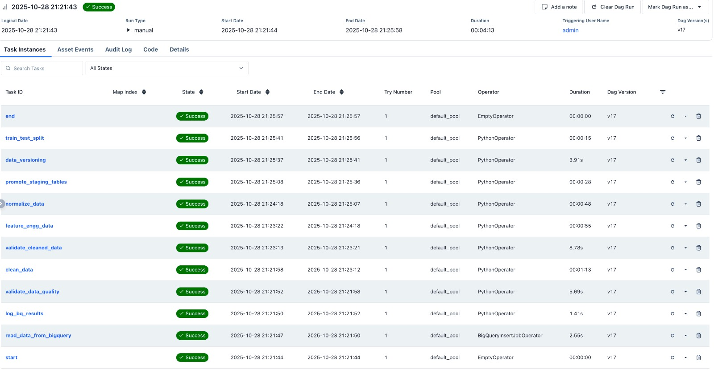
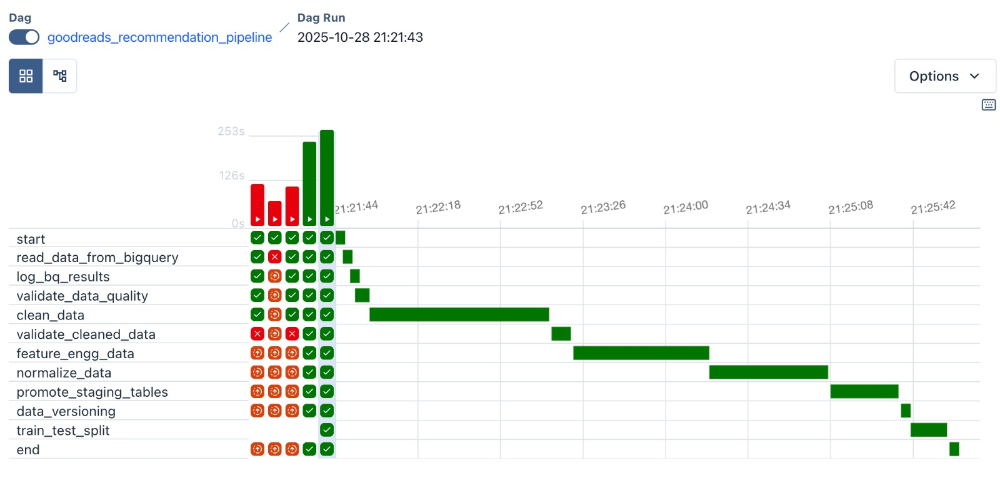
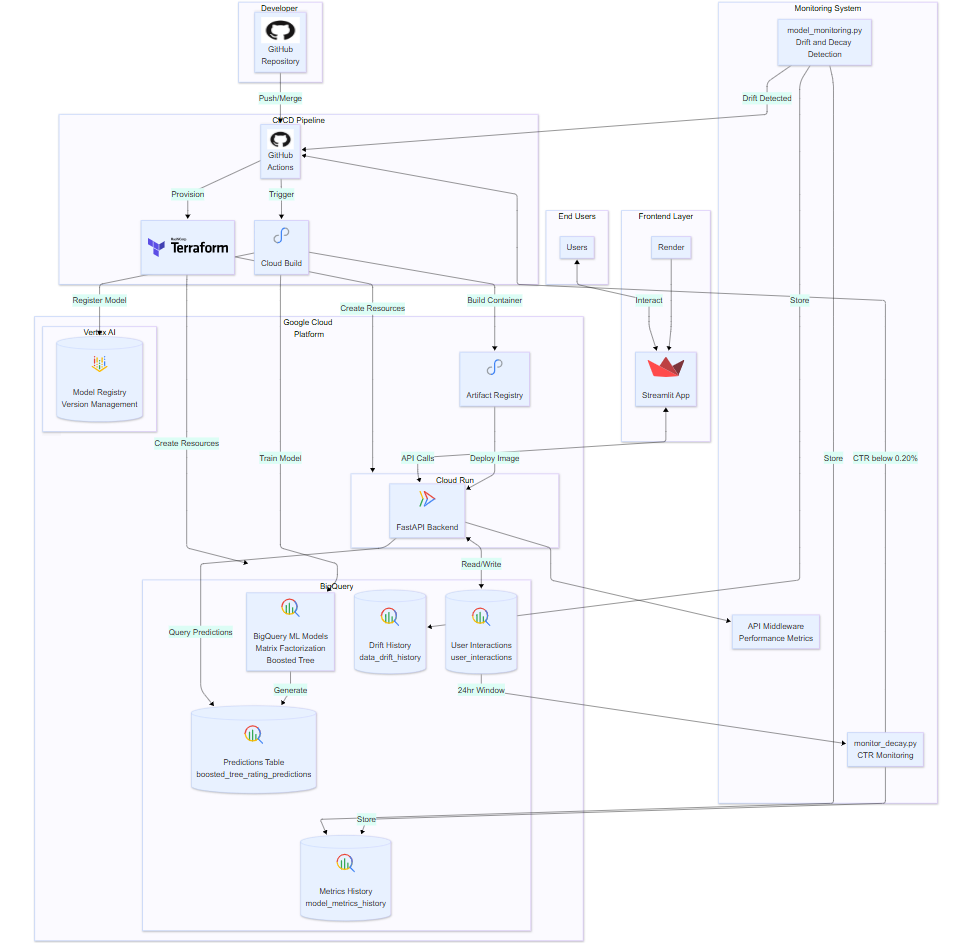
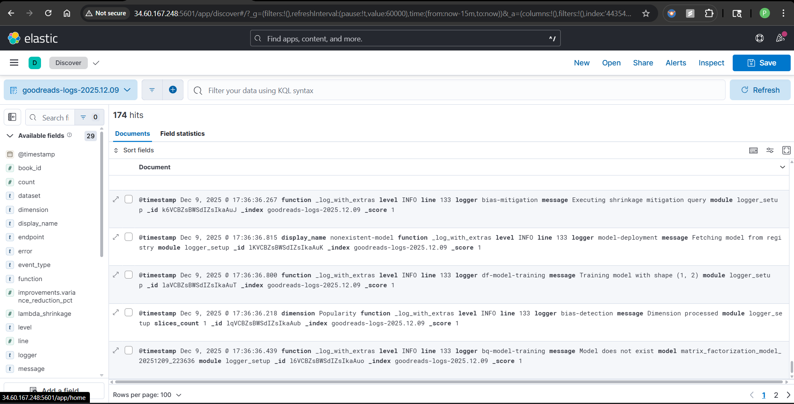

# Book Recommendation System (Goodreads + MLOps)

This project builds a machine learning-based book recommendation system using Goodreads data, with an end-to-end MLOps-ready architecture that includes data processing, model training, recommendation logic, automated deployment, APIs for serving, Click-Through Rate calculation, and continuous monitoring.

We have implemented Click Through Rate which makes our static data dynamic, where we monitor the click to view ratio per user for the recommendations provided to identify the model decay and data drift and then use this new data with the old to retrain the model.

## Table of Contents
- [Team Members](#team-members)
- [Phase 1. Data Pipeline](#phase-1-data-pipeline)
- [Phase 2. Model Development](#phase-2-model-development)
- [Phase 3. Model Deployment](#phase-3-model-deployment)
- [Project Frontend](#project-frontend)
- [Project Recreation](#project-recreation)

## Team Members

- Ananya Asthana
- Arpita Wagulde
- Karan Goyal
- Purva Agarwal
- Shivam Sah
- Shivani Sharma

## Demo

[Demo Link](https://drive.google.com/drive/folders/1ShGyE2b47LKBQ6ERAAftbwLJdV6FyiUy)

## Phase 1. Data Pipeline

### Overview

The data pipeline leverages **Apache Airflow** with **Google Cloud Platform (GCP)** to process Goodreads book ratings data from the mystery/thriller/crime genre subset. The pipeline transforms raw data into ML-ready features through automated processing stages.
### Key Components

#### Data Architecture
- **Source**: Books, interactions and authors data from Goodbooks dataset
- **Storage**: Google BigQuery for scalable data processing
- **Orchestration**: Apache Airflow DAG (`goodreads_ctr_data_pipeline`)
- **Version Control**: DVC for data versioning with GCS integration

#### Pipeline Tasks
1. **Data Reading**: Extracts data from BigQuery source tables with validation
2. **Data ETL**: Prepares the interaction data to accomodate CTR logic
2. **Data Cleaning**: Removes duplicates, standardizes text, handles missing values
3. **Feature Engineering**: Creates book-level, user-level, and interaction features
4. **Data Normalization**: Applies Min-Max scaling for ML model consumption
5. **Staging Promotion**: Moves processed data from staging to production tables
6. **Data Versioning**: Tracks data evolution using DVC
7. **Train, Test, and Validation Split**: Splits the processed data into training, testing, and validation sets for model development.

#### Quality Assurance
- **Multi-stage Validation**: Pre-cleaning and post-cleaning data quality checks
- 1. Pre-cleaning (validate_data_quality task): Validates source data before any processing
- 2. Post-cleaning (validate_cleaned_data task): Validates cleaned data before feature engineering
- **Anomaly Detection**: Automated identification of data quality issues
- **Email Monitoring**: Failure and success notifications for pipeline health

### Data Processing Scale
- **Raw Data**: Books and ratings from mystery/thriller/crime genre
- **Cleaning**: Handles text standardization, timestamp validation, outlier removal
- **Feature Engineering**: Computes book popularity, user activity patterns, reading times
- **Final Dataset**: Train/val/test splits ready for ML model training

### Bias Analysis & Fairness Assessment on the data [(`bias_analysis.ipynb`)](https://github.com/purva-agarwal/goodreads_recommendations/blob/master/datapipeline/data/notebooks/bias_analysis.ipynb)
- **Analysis Dimensions:**
  - 1. **Popularity Bias** - High/Medium/Low popularity groups (based on book_popularity_normalized)
  - 2. **Book Length Bias** - Categories based on book_length_category
  - 3. **Book Era Bias** - Publication era groups (book_era)
  - 4. **User Activity Bias** - High/Medium/Low activity user groups (based on user_activity_count)
  - 5. **Reading Pace Bias** - Fast/Medium/Slow reader categories (reading_pace_category)
  - 6. **Author Gender Bias** - Male/Female author groups (using gender_guesser library)
  
<div>
<div>


For more detailed data pipeline documentation, see [`README_data.md`](README_data.md)

## Phase 2. Model Development

### ML Pipeline Overview
This project implements an automated ML pipeline using **GitHub Actions** with **MLflow** tracking and **Vertex AI** model registry. The pipeline covers data loading, model training, bias detection, evaluation, validation, and deployment.
It uses GitHub Actions to automate the complete ML pipeline from data loading to model deployment. The workflows are orchestrated in a sequential pipeline that ensures data quality, model training, evaluation, bias detection, validation, and version management.
```text
┌─────────────────┐
│  PR Test Suite  │ (On Pull Requests)
└────────┬────────┘
         │
         ▼
┌─────────────────┐
│  1. Load Data   │ (Auto: After Airflow Pipeline OR Manual)
└────────┬────────┘
         │
         ▼
┌──────────────────────┐
│ 2. Train Model       │ (Auto: After Load Data)
│    & Register        │
└────────┬─────────────┘
         │
         ▼
┌──────────────────────┐
│ 3. Generate          │ (Auto: After Training)
│    Predictions       │
└────────┬─────────────┘
         │
         ▼
┌─────────────────┐
│ 4. Evaluate     │ (Auto: After Predictions)
│    Model        │
└────────┬────────┘
         │
         ▼
┌──────────────────────┐
│ 5. Bias Detection    │ (Auto: After Evaluation)
│    & Mitigation      │
└────────┬─────────────┘
         │
         ▼
┌─────────────────┐
│ 6. Model        │ (Auto: After Bias Pipeline)
│    Validation   │
└────────┬────────┘
         │
         ▼
┌─────────────────┐
│ 7. Model Manager│ (Auto: After Validation)
└────────┬────────┘
         │
         ▼
┌──────────────────────┐
│   8. Deploy Model    │ (Auto: After Model Manager)
│       Endpoint       │
└────────┬─────────────┘
         │
         ▼
┌─────────────────┐
│ 9. Model        │ (Auto: After Model Endpoint Deployment)
│    Monitoring   │
└────────-────────┘

┌─────────────────┐
│ Send Email      │ (Called by all workflows)
│ Notification    │
└─────────────────┘
```
**GitHub Actions Workflow Screenshots:**


### Algorithm Selection

Two recommendation algorithms were implemented and compared:

#### Matrix Factorization
- **Purpose**: Decomposes user-item rating matrix into latent factors
- **Key Parameters**: Number of factors, L2 regularization, iterations
- **Strengths**: Good at capturing user-item relationship patterns
- **Performance**: Strong baseline with RMSE around 0.75-0.85

#### Boosted Tree Regressor
- **Purpose**: Gradient boosting for regression on user-item features
- **Key Parameters**: Tree depth, number of trees, subsample ratio
- **Decision Process**: Fed with user, book, and interaction features
- **Performance**: Superior accuracy with RMSE around 0.60-0.70

### Bias Detection & Mitigation

#### 8-Dimensional Fairness Analysis
The system analyzes bias across multiple dimensions:
- **Demographic**: Author gender, publication era, book length
- **Behavioral**: User activity, reading pace
- **Content-Based**: Genre diversity, popularity, rating patterns

#### Mitigation Techniques
- **Group-level Shrinkage**: Reduces rating disparities using λ parameter
- **Threshold Adjustment**: Balances decision boundaries per slice
- **Re-weighting**: Updates training sample weights for problematic groups

#### Fairness Metrics
- **Equity Index**: Balances accuracy preservation with disparity reduction
- **Performance Deltas**: MAE/RMSE change across protected groups
- **Mitigation Validation**: Post-mitigation analysis confirms reduced bias

### Model Selection Process
**Criteria**: Accuracy + fairness trade-off
- **Weighted Scoring**: Configurable balance between RMSE and equity metrics
- **Threshold Enforcement**: Minimum fairness requirements
- **Automated Selection**: Recommends best model for deployment

### Experiment Tracking

#### MLflow Integration
- **Metrics Logging**: RMSE, MAE, R², SHAP feature importance
- **Parameter Tracking**: Hyperparameters and training configurations
- **Artifact Storage**: Evaluation reports, visualizations, model artifacts

#### Optimization
- **Feature Sensitivity Analysis**: Identifies features with greatest impact using SHAP-based feature importance analysis
- **Performance Trade-offs**: Visualizes accuracy vs computational cost
- **Optimization Results**: Optimal parameter combinations documented

### ML Pipeline Stages
1. **Data Loading**: Pulls curated training data from BigQuery
2. **Model Training**: Trains both algorithms in parallel with MLflow tracking
3. **Bias Detection**: Comprehensive fairness analysis across 8 dimensions
4. **Evaluation**: SHAP-based feature importance and performance metrics
   4.1. Evaluation reports in docs/model_analysis/evaluation/
   4.2. Feature importance analysis in docs/model_analysis/sensitivity/
   4.3. MLflow logged evaluation metrics
   4.4. Artifacts committed to artifacts_bot branch
5. **Validation**: Quality gates for production readiness
6. **Registry**: Saves models to Vertex AI Model Registry with versioning
7. **Selection**: Compares multiple candidate models based on both performance metrics and fairness scores.

For complete model development documentation, see [`README_model.md`](README_model.md).

## Phase 3. Model Deployment



### Cloud Deployment Strategy

The project implements **cloud-based deployment** on **Google Cloud Platform (GCP)**, selected for its managed ML services, scalability, and integration with the existing BigQuery data pipeline. The deployment strategy leverages Vertex AI for model serving, Cloud Build for automation, and Cloud Run for the API backend.

#### Cloud Deployment Components

**1. Model Deployment Service**
- **Service Used**: Vertex AI (Google Cloud Platform)
- **Endpoint Details**: Automated endpoint creation with `goodreads-recommendation-endpoint` deployed on render for frontend and CloudRun for backend APIs
- **Scaling**: Configurable instance counts (1-3 replicas)

**2. Deployment Automation**
- **CI/CD Pipeline**: GitHub Actions workflows trigger automated deployments
- **Cloud Build Integration**: `cloudbuild.yaml` orchestrates deployment steps
- **Repository Connection**: Direct integration with GitHub via service account
- **Automated Triggers**: New model versions deploy automatically via pipeline

**3. Infrastructure as Code**
- **Terraform Configuration**: `terraform/main.tf` manages Vertex AI endpoints and service accounts
- **Resource Management**: Automated provisioning of required GCP APIs
- **Service Accounts**: Dedicated Cloud Run service account for secure API access
- **Environment Management**: Supports dev/staging/prod environments

### CTR (Click Through Rate) System

#### Overview
The CTR system measures how users interact with the recommendations they receive.
It tracks every view, click, and engagement event that occurs on the frontend and stores these as structured interaction logs.
These logs are then used to:
- Monitor real-time engagement 
- Detect model decay 
- Trigger alerts 
- Automatically initiate model retraining when necessary

CTR is one of the most direct indicators of how well your recommendation model is performing in real-world usage.

#### CTR Data Schema

**Table**: `books.user_interactions`

| Field | Type | Description |
|-------|------|-------------|
| `event_id` | STRING | UUID for each interaction |
| `user_id` | STRING | User identifier |
| `book_id` | INT64 | Book identifier |
| `book_title` | STRING | Book title for analytics |
| `event_type` | STRING | `view`, `click`, `like`, `add_to_list` |
| `event_timestamp` | TIMESTAMP | Partitioned timestamp |

#### How it works
**1. User Interactions Are Logged**
- Whenever a user sees or interacts with a recommendation on the frontend, an event is generated automatically.
- These include:
  - View events when a book recommendation is displayed
  - Click or engagement events when the user interacts with a recommended book
- These events are silently captured without affecting the user experience.

**2. Events Are Sent to the Backend**
- Each event is forwarded from the frontend to the backend API.
- Two types of endpoints receive:
  - View events
  - Click / engagement events
- The backend validates and forwards these events to storage.

**3. Events Are Stored in BigQuery**
- Every interaction is saved as a row in the user_interactions table in BigQuery. 
- Stored fields typically include:
  - User ID
  - Book ID
  - Event type (view, click, etc.)
  - Timestamp
- This creates a detailed history of user engagement with recommendations.

**4. CTR Is Calculated on a Rolling Basis**
- A scheduled monitoring job regularly reads the last 24 hours of event data and computes CTR using the formula:
- CTR = (Number of Clicks) / (Number of Views)
- This provides a real-time measure of how engaging the recommendations are.

**5. CTR Is Compared Against a Decay Threshold**
- The system checks whether the current CTR meets an expected performance threshold.
- Threshold: CTR < 20% → Model is considered to be decaying
- A drop in CTR indicates that the model may no longer be producing high-quality recommendations.

**6. Alerts Are Sent When CTR Drops**
- If the CTR falls below the threshold:
  - An alert is generated
  - Email notifications are sent to the ML team
  - Monitoring logs are updated
- This ensures immediate visibility into potential declines in model performance.

**7. CTR Decay Triggers Model Retraining**
- When sustained CTR decay is detected:
  - The monitoring workflow flags the issue
  - The ML pipeline is automatically triggered
  - The model is retrained using the latest data
  - Evaluation, bias detection, and validation are rerun
  - Model Manager decides whether to promote the new version
- This creates a self-correcting feedback loop that keeps the recommendation engine fresh and relevant.

#### CTR Calculation

```sql
-- 24-hour CTR calculation
SELECT
    COUNTIF(event_type = 'view') as views,
    COUNTIF(event_type = 'click') as clicks,
    SAFE_DIVIDE(COUNTIF(event_type = 'click'), COUNTIF(event_type = 'view')) as ctr
FROM `project.books.user_interactions`
WHERE event_timestamp >= TIMESTAMP_SUB(CURRENT_TIMESTAMP(), INTERVAL 24 HOUR)
```

#### CTR Monitoring Workflow

**Workflow**: `9_model_monitoring.yml`
1. Monitor: Continuously compute CTR over the most recent 24 hours 
2. Detect: Check if CTR is below the decay threshold 
3. Validate: Confirm that the drop is significant and not a temporary fluctuation 
4. Alert: Notify stakeholders that model performance is declining 
5. Retrain: Trigger the full ML pipeline to generate a new model 
6. Evaluate: Only promote the new model if it performs better 
7. Deploy: Update production with the improved recommendation model 
8. This creates an automated feedback loop that keeps your recommendation engine fresh and aligned with real-world user behavior.

```yaml
jobs:
  model-monitoring:
    steps:
      - name: Run Model Monitoring
        run: |
          python -c "
          from src.model_monitoring import run_full_monitoring
          results = run_full_monitoring(model_name='boosted_tree_regressor')
          if results['decay_results'].get('decay_detected'):
              exit(1)  # Trigger retraining
          "
```

#### CTR Thresholds & Alerts

- **Decay Threshold**: CTR < 20% triggers model decay alerts (defined in `src/monitor_decay.py`)
- **Alert Channels**: Email notifications to ML team
- **Recovery Action**: Automatic retraining pipeline initiation
- **Reporting**: Daily CTR reports in monitoring dashboard

#### CTR-Driven Retraining

1. **Detection**: 24-hour rolling CTR calculation
2. **Validation**: Multiple checks to avoid false positives
3. **Trigger**: GitHub Actions workflow dispatch to retraining pipeline
4. **Fallback**: Manual retraining approval for critical alerts

### API Architecture

#### FastAPI Backend Overview

**Base URL**: `https://recommendation-service-{PROJECT_NUMBER}-{REGION}.run.app`

**Technology Stack**:
- **Framework**: FastAPI with auto-generated API docs
- **Language**: Python 3.11
- **Deployment**: Google Cloud Run (serverless)
- **Database**: Google BigQuery (OLAP analytics)
- **Caching**: Redis (optional, for high traffic)
- **Monitoring**: Custom middleware with real-time metrics

#### Core API Endpoints

#### 1. Recommendation Engine

```http
GET /load-recommendation?user_id={user_id}
```

**Purpose**: Get personalized book recommendations
- **New Users**: Returns global top-10 books
- **Existing Users**: Queries Vertex AI endpoint for predictions
- **Response**: JSON with `recommendations` array
- **Monitoring**: Automatic CTR view logging

**Response Format**:
```json
{
  "user_id": "user_12345",
  "recommendations": [
    {
      "book_id": 5988,
      "title": "The Hobbit",
      "author": "J.R.R. Tolkien",
      "predicted_rating": 4.62
    }
  ]
}
```

#### 2. CTR Event Logging

```http
POST /book-click
Content-Type: application/json

{
  "user_id": "user_12345",
  "book_id": 5988,
  "book_title": "The Hobbit",
  "event_type": "click"
}
```

**Event Types**: `view`, `click`, `like`, `add_to_list`
**Use Cases**: CTR tracking, user behavior analytics, model performance

#### 3. User History Management

```http
GET /books-read/{user_id}
GET /books-unread/{user_id}
```

**Read Books**: Shows user's previously marked books with read dates
**Unread Books**: Personalized unread book suggestions
**Rating Integration**: Connects to interaction history

#### 4. Frontend Metrics Collection

```http
POST /frontend-metrics
```

**Purpose**: Web Vitals and frontend performance data
- **Source**: Streamlit app with JavaScript monitoring
- **Metrics**: LCP, INP, CLS, FCP, TTFB
- **Integration**: Real-time user experience tracking

#### 5. Mark Book as Read

```http
POST /mark-read
Content-Type: application/json

{
  "user_id": "user_12345",
  "book_id": 5988,
  "rating": 4
}
```

**Purpose**: Records user reading history and ratings in BigQuery
- **Rating Range**: 1-5 stars
- **Storage**: BigQuery `interactions` table for model retraining

#### 6. Health & Root Endpoints

```http
GET /              # Root endpoint with API info
GET /health        # Health check for load balancer probes
```

#### 7. Administrative Endpoints

```http
GET /report                    # Admin monitoring dashboard (Basic Auth: admin/admin)
GET /report/api/metrics        # Model metrics JSON
GET /report/api/drift          # Drift detection data
GET /metrics                   # Real-time API metrics
GET /metrics/timeline          # Request timeline data
```

#### API Performance Monitoring

**Middleware Integration** (`api/middleware.py`):
- **Response Times**: P50, P95, P99 percentiles tracked per endpoint
- **Error Rates**: HTTP error classification (4xx client, 5xx server)
- **Throughput**: Requests per second/minute with time-series storage
- **Active Connections**: Current concurrent requests counter
- **Timeline History**: Last 1000 requests stored for analysis

**Metrics Collector Features**:
```python
from .middleware import MonitoringMiddleware, get_metrics_collector

app.add_middleware(MonitoringMiddleware)
collector = get_metrics_collector()

# Available metrics:
# - collector.request_count: Total requests processed
# - collector.error_count: Total errors by status code
# - collector.response_times: Per-endpoint latency distribution
# - collector.active_requests: Current concurrent requests
# - collector.get_percentile_stats(): P50/P95/P99 statistics
```

**Metrics Endpoints**:
- `GET /metrics`: Real-time metrics summary (JSON)
- `GET /metrics/timeline`: Historical request data for charts
- `POST /metrics/frontend`: Web Vitals collection from browser

**Dashboard Integration**: Real-time metrics displayed in admin dashboard at `/report` with automatic alerting for performance degradation.

#### API Data Models (`api/data_models.py`)

**Request Models**:
```python
class RecommendationRequest:
    user_id: str              # Required user identifier

class ClickEventRequest:
    user_id: str              # User who performed action
    book_id: int              # Target book
    book_title: str           # Book title for logging
    event_type: str           # view, click, like, add_to_list

class MarkReadRequest:
    user_id: str              # User marking book
    book_id: int              # Book being marked
    rating: int               # 1-5 star rating

class FrontendMetrics:
    lcp: float                # Largest Contentful Paint
    inp: float                # Interaction to Next Paint
    cls: float                # Cumulative Layout Shift
    fcp: float                # First Contentful Paint
    ttfb: float               # Time to First Byte
    user_id: Optional[str]    # Associated user
```

**Response Models**:
```python
class BookRecommendation:
    book_id: int
    title: str
    author: str
    predicted_rating: float   # Model's predicted rating

class RecommendationResponse:
    user_id: str
    recommendations: List[BookRecommendation]
```

#### API Security & Authentication

- **CORS**: Configured for Streamlit frontend access (`allow_origins=["*"]`)
- **Rate Limiting**: Implemented via Cloud Run concurrency controls (80 req/instance)
- **Admin Auth**: HTTP Basic Authentication for `/report` dashboard (admin/admin)
- **BigQuery IAM**: Service account with read-only access to model tables
- **Environment Variables**: GCP project, dataset, and model names via env vars

## Project Frontend 
### Overview

**URL**: Served as static files via FastAPI `/app` endpoint
**Technology**: Streamlit with custom React components
**Features**: Full book recommendation interface with rich user interactions
**Performance**: Web Vitals monitoring integrated into user experience


#### Repository Integration & CI/CD

**GitHub Actions Workflows**:

| Workflow | File | Purpose | Trigger |
|----------|------|---------|---------|
| Model Deployment | `8_model_deploy_endpoint.yml` | Deploy model to Vertex AI endpoint | Manual dispatch, after training |
| Model Monitoring | `9_model_monitoring.yml` | Run drift detection and performance checks | Auto: After Model Deployment |
| Decay Monitoring | `model_decay.yml` | CTR monitoring and retraining triggers | Scheduled daily (cron), auto-triggers retraining on decay |
| Docker Model Build | `docker-model-build-push.yml` | Build ML Docker image and push to GHCR | Auto: Push to `src/**`, manual |
| ELK Stack | `deploy_elk.yml` | Deploy ELK stack for log aggregation | Auto: Push to `terraform/elk.tf`, manual |
| API Backend | `deploy-api-backend.yml` | Deploy FastAPI to Cloud Run | Push to main, manual |
| Infrastructure | `terraform_infra.yml` | Provision GCP resources | Manual dispatch |

**Workflow Details**:
- **8_model_deploy_endpoint.yml**: 
  - Authenticates to GCP via Workload Identity
  - Runs `src/model_deployment.py` to deploy selected model version
  - Configures traffic split and machine type
  - Verifies deployment health

- **9_model_monitoring.yml**:
  - Executes `src/model_monitoring.py` for comprehensive analysis
  - Generates drift reports and performance metrics
  - Creates GitHub artifacts with monitoring results
  - Sends alerts on threshold breaches

- **model_decay.yml**:
  - Runs `src/monitor_decay.py` for CTR analysis
  - Queries BigQuery for 24-hour event aggregation
  - Triggers retraining pipeline if CTR < 20%
  - Sends email notifications on decay detection

#### Automated Deployment Scripts

**Cloud Build Configuration** (`cloudbuild.yaml`):
```yaml
steps:
  - id: 'fetch-model-info'
    # Retrieves model from Vertex AI Registry
  - id: 'check-endpoint'
    # Creates or verifies endpoint existence
  - id: 'deploy-model'
    # Executes Python deployment script
  - id: 'verify-deployment'
    # Health checks and validation
```

**Python Deployment Script** (`src/model_deployment.py`):
- **Model Retrieval**: Fetches models from Vertex AI registry
- **Endpoint Management**: Creates or updates endpoints
- **Traffic Management**: Handles gradual rollouts with percentage splits
- **Logging**: Cloud Logging integration for deployment events
- **Health Verification**: Automated post-deployment validation

#### API Backend Architecture

**FastAPI Application** (`api/main.py`):
- **Endpoints**: Recommendation, health checks, monitoring dashboards
- **CORS Support**: Web client integration
- **Monitoring Middleware**: Real-time performance tracking
- **BigQuery Integration**: Direct model prediction queries

**Cloud Run Configuration** (`terraform/main.tf`):
- **Scaling**: Min 0 / Max 10 replicas with 80% CPU utilization trigger
- **Resource Limits**: 1 CPU, 512Mi memory per instance
- **Concurrency**: 80 requests per container instance
- **Timeout**: 300 seconds request timeout
- **Security**: Service account with BigQuery read access
- **Networking**: Internal and external load balancing with health checks

**Vertex AI Infrastructure** (`terraform/vertex_ai.tf`):
- **Metrics Scope**: Centralized monitoring across all ML endpoints
- **Alert Policies**: Automated alerting for prediction latency and error rates
- **Dashboard**: Custom monitoring dashboard for model performance visualization
- **Notification Channels**: Email alerts to ML team for critical events

### Model Monitoring and Retraining

#### Monitoring Framework

**Performance Metrics**:
- **Model Decay**: Click-Through Rate (CTR) monitoring over 24-hour windows
- **Thresholds**: CTR < 20% triggers alerts and retraining (defined in `src/monitor_decay.py`)
- **Data Sources**: User interaction logs in BigQuery

**Drift Detection** (`src/model_monitoring.py`):
- **Input Distribution**: Monitors feature distributions over time
- **Statistical Tests**:
  - Kolmogorov-Smirnov (KS) test with p-value threshold < 0.05
  - Population Stability Index (PSI) threshold > 0.2
  - Mean shift detection > 2.0 standard deviations
- **Feature Monitoring**: Tracks `user_avg_rating`, `book_avg_rating`, `user_book_count`, `book_rating_count`
- **Comparison Window**: Reference vs current data distributions

**Monitoring Dashboard** (`api/monitoring_dashboard.py`):
- **Access**: `/report` endpoint with HTTP Basic Auth (admin/admin)
- **Model Metrics Panel**: 
  - Active model version and deployment timestamp
  - RMSE, MAE, R², Explained Variance scores
  - Performance trend charts over time
- **Drift Detection Panel**:
  - Feature drift status with color-coded indicators
  - PSI scores, KS test p-values, mean shifts
  - Automated drift alerts when thresholds exceeded
- **API Performance Panel**:
  - Request latency percentiles (P50, P95, P99)
  - Error rate heatmaps by hour
  - Throughput and active connections
- **Auto-refresh**: Dashboard updates every 30 seconds

#### Retraining Automation

**Triggering Mechanisms**:
- **Performance Thresholds**: RMSE/MAE increase > 10%, R² decrease > 0.05, accuracy drop > 5%
- **Drift Detection**: Significant input distribution changes
- **Schedule-based**: Periodic retraining windows (weekly/monthly)

**Automated Pipeline**:
- **CI/CD Integration**: Full pipeline reruns on trigger detection
- **Model Comparison**: A/B testing with deployed vs new models
- **Rollback Capabilities**: Automatic failback on performance degradation

**Scripts and Configurations**:
- **monitor_decay.py**: CTR monitoring with BigQuery aggregation
- **model_monitoring.py**: Comprehensive drift and performance analysis
- **Workflow Integration**: GitHub Actions handle full retraining cycles

#### Monitoring Code Components

**Decay Detection** (`src/monitor_decay.py`):
- **CTR Calculation**: Aggregates views vs clicks over time windows
- **Threshold Alerts**: Email notifications on performance drops
- **BigQuery Queries**: Efficient distributed computation

**Model Monitoring** (`src/model_monitoring.py`):
- **Drift Analysis**: Statistical tests for distribution changes
- **Performance Tracking**: RMSE/MSE monitoring over time
- **Report Generation**: Structured JSON and visualization outputs

**API Monitoring** (`api/main.py` + middleware):
- **Request Tracking**: Latency, error rates, throughput metrics
- **Frontend Metrics**: Web vitals collection from browser clients
- **Health Checks**: Automated endpoint accessibility verification

#### Retraining Pipeline Integration

**Workflow Chain**:
- **Monitoring Detection** → **Notification** → **Pipeline Trigger** → **Model Comparison** → **Production Deployment**

**Quality Gates**:
- **Validation Tests**: Performance must exceed thresholds
- **Bias Checks**: Fairness preserved in retrained models
- **Integration Tests**: End-to-end prediction validation

**Automation Safety**:
- **Manual Approval**: Critical retraining requires human review
- **Gradual Rollout**: 10% traffic split, then full migration on success
- **Rollback Plans**: Automatic reversion on performance degradation

### Evaluation Criteria Implementation

**Correctness and Completeness**:
- Automated deployment scripts complete without manual intervention
- Full pipeline execution from GitHub Actions triggers
- Multiple environment support (dev/staging/prod)

**Documentation and Replication**:
- Cloud Build YAML for step-by-step GCP deployment
- Terraform configurations for infrastructure recreation
- Detailed environment setup and permission guides

**CI/CD Integration**:
- GitHub Actions workflows for automated deployment on model changes
- Vertex AI Model Registry integration for version management
- Repository webhook triggers for continuous deployment

**Model Monitoring and Retraining**:
- Performance monitoring with CTR and drift detection
- Automated retraining pipeline with quality checks
- Notification systems for model health and retraining status

For comprehensive documentation on all pipeline components, see [`README_data.md`](README_data.md) and [`README_model.md`](README_model.md).

### ELK Stack (Log Aggregation)

#### Overview

The project includes a complete **ELK Stack** (Elasticsearch, Logstash, Kibana) deployment for centralized log aggregation and monitoring. This enables real-time visibility into application logs, API requests, and system events.

#### Components

| Component | Purpose | Port |
|-----------|---------|------|
| Elasticsearch | Log storage and search engine | 9200 |
| Logstash | Log ingestion and processing | 5044 |
| Kibana | Visualization dashboard | 5601 |
| Filebeat | Log shipping from containers | - |

#### Deployment Options

**Option 1: Local Docker Compose**
```bash
docker compose -f docker-compose.elk.yaml up -d
```

**Option 2: GCP Compute Engine (via Terraform)**
```bash
# Deploy via GitHub Actions
GitHub → Actions → "Deploy ELK Stack" → Run workflow

# Or manually via Terraform
cd terraform
terraform apply -target=google_compute_instance.elk_stack
```

#### Configuration Files

| File | Purpose |
|------|---------|
| `docker-compose.elk.yaml` | Local ELK stack orchestration |
| `elk/elasticsearch/elasticsearch.yml` | Elasticsearch configuration |
| `elk/logstash/pipeline/logstash.conf` | Log parsing rules |
| `elk/kibana/kibana.yml` | Kibana dashboard settings |
| `elk/filebeat/filebeat.yml` | Log shipping configuration |
| `terraform/elk.tf` | GCP infrastructure for ELK |

#### Access URLs

- **Kibana Dashboard**: `http://<ELK_IP>:5601`
- **Elasticsearch API**: `http://<ELK_IP>:9200`

#### Workflow

The `deploy_elk.yml` workflow automatically deploys the ELK stack when:
- Changes are pushed to `terraform/elk.tf`
- Manually triggered via GitHub Actions



## Project Frontend
For details about the Streamlit frontend, including setup, deployment, and validation steps, see **[`README_frontend.md`](README_frontend.md)**.

## Project Recreation

For detailed instructions on replicating this project on other machines or platforms, including setup, deployment, and validation steps, see **[`README_project_replication.md`](README_project_replication.md)**.

---

**Note**: This README provides implementation highlights aligned with the PDF deployment requirements. The full codebase demonstrates production-ready MLOps practices with automated deployment, monitoring, and continuous improvement capabilities.
