# Book Recommendation System - Model Training & ML Pipeline

> **Note:** For general project information, team members, data sources, and basic setup instructions, please refer to [README_data.md](README_data.md).

This document focuses specifically on the **ML model training pipeline**, **GitHub Actions CI/CD workflows**, **bias detection and mitigation**, and **model deployment** aspects of the project.

## Getting Started

> **Note:** To run our project on Windows machine, ensure WSL is installed.

For basic setup instructions (cloning repository, Python environment setup), please refer to [README_data.md](README_data.md).

> **Note:** For instructions on running the data pre-processing pipeline without Docker, please refer to [README_data.md](README_data.md#3-run-training-pipeline).

### Running with Docker

To run the ML pipeline using Docker, you have two options:

#### Option 1: Manual Docker Steps

1. **Pull the Docker image** from GitHub Container Registry:

   ```bash
   docker pull ghcr.io/purva-agarwal/goodreads-model:latest
   ```

   The image is available at: <https://github.com/purva-agarwal/goodreads_recommendations/pkgs/container/goodreads-model>

2. **Run the Docker container** with the required volume mounts and environment variables:

   ```bash
   docker run --rm \
     -v $(pwd)/config:/app/config \
     -v $(pwd)/docs:/app/docs \
     -e GOOGLE_APPLICATION_CREDENTIALS=/app/config/gcp_credentials.json \
     ghcr.io/purva-agarwal/goodreads-model:latest
   ```

#### Option 2: Using Make (Recommended)

Simply run:

```bash
make run-ghcr
```

This command automatically handles the image pull and container execution with the correct configuration.

> **Note:** Ensure that your `config/gcp_credentials.json` file is present before running the Docker container.

## GitHub Actions

Our project uses GitHub Actions to automate the complete ML pipeline from data loading to model deployment. The workflows are orchestrated in a sequential pipeline that ensures data quality, model training, evaluation, bias detection, validation, and version management.

### Pipeline Overview

The CI/CD pipeline consists of **8 sequential workflows** plus **1 supporting workflow**:

```text
PR Test Suite
   ↓
1. Load Data
   ↓
2. Model Training & Register
   ↓
3. Generate Predictions
   ↓
4. Evaluate Model
   ↓
5. Bias Detection & Mitigation Pipeline
   ↓
6. Model Validation
   ↓
7. Model Manager
```

**Supporting Workflows:**
- **Send Email Notification** - Reusable workflow for sending notifications

### Pipeline Flow Diagram

```text
┌─────────────────┐
│  PR Test Suite  │ (On Pull Requests)
└────────┬────────┘
         │
         ▼
┌─────────────────┐
│  1. Load Data   │ (Manual Trigger)
└────────┬────────┘
         │
         ▼
┌──────────────────────┐
│ 2. Train Model       │ (Auto: After Load Data)
│    & Register        │
└────────┬─────────────┘
         │
         ▼
┌──────────────────────┐
│ 3. Generate          │ (Auto: After Training)
│    Predictions       │
└────────┬─────────────┘
         │
         ▼
┌─────────────────┐
│ 4. Evaluate     │ (Auto: After Predictions)
│    Model        │
└────────┬────────┘
         │
         ▼
┌──────────────────────┐
│ 5. Bias Detection     │ (Auto: After Evaluation)
│    & Mitigation       │
└────────┬──────────────┘
         │
         ▼
┌─────────────────┐
│ 6. Model         │ (Auto: After Bias Pipeline)
│    Validation   │
└────────┬────────┘
         │
         ▼
┌─────────────────┐
│ 7. Model Manager│ (Auto: After Validation)
└─────────────────┘

┌─────────────────┐
│ Send Email      │ (Called by all workflows)
│ Notification    │
└─────────────────┘
```

### Key Features of the Pipeline

1. **Sequential Execution**: Each workflow triggers the next only on success
2. **Failure Handling**: Pipeline stops on failure, preventing bad models from progressing
3. **Artifact Management**: All artifacts committed to `artifacts_bot` branch for versioning
4. **MLflow Integration**: Automatic MLflow server management for experiment tracking
5. **Email Notifications**: Automated notifications for every workflow execution
6. **Quality Gates**: Multiple validation checkpoints ensure model quality
7. **Bias Detection**: Comprehensive bias analysis before deployment
8. **Automated Versioning**: Model version management integrated into pipeline

### Required GitHub Secrets

The workflows require the following secrets to be configured in GitHub:

- `GCP_CREDENTIALS`: Google Cloud Platform service account JSON credentials
- `SMTP_EMAIL`: Gmail address for sending notifications
- `SMTP_PASSWORD`: Gmail app password for SMTP authentication
- `GITHUB_TOKEN`: Automatically provided by GitHub Actions (for artifact access)

### Artifact Branch Strategy

All generated artifacts (models, reports, visualizations) are committed to the `artifacts_bot_<datestamp>` branch rather than the main branch. This strategy:

- **Keeps main clean**: Main branch contains only source code
- **Version control**: All artifacts are versioned and tracked
- **Easy access**: Artifacts can be accessed via the dedicated branch
- **CI/CD friendly**: Doesn't trigger additional workflows from artifact commits

### Monitoring and Debugging

- **Workflow Logs**: Detailed logs available in GitHub Actions UI
- **Email Notifications**: Receive notifications for every workflow run
- **Artifact Inspection**: All artifacts available in `artifacts_bot` branch
- **MLflow Tracking**: Model metrics tracked in MLflow (when MLflow server is running)

### Supporting Workflows

#### PR Test Suite (`pr_tests.yml`)

**Purpose:** Runs automated tests on pull requests to ensure code quality before merging.

**Trigger:** Automatically runs on pull requests targeting the `master` branch

**Steps:**

1. **Checkout code** - Retrieves PR code
2. **Set up Python 3.11** - Configures environment
3. **Install dependencies** - Installs packages from `model_requirements.txt`
4. **Install dev/test dependencies** - Installs pytest, pytest-cov, and seaborn
5. **Install project as package** - Installs the project in editable mode (`pip install -e .`)
6. **Run Tests** - Executes pytest with verbose output on all tests in `./tests` directory

**Key Features:**
- **Pre-Merge Validation**: Ensures code quality before merging
- **Comprehensive Testing**: Runs all unit tests
- **Fast Feedback**: Provides quick feedback to developers

**Test Coverage:**
- Unit tests for data processing modules
- Unit tests for bias detection and mitigation
- Unit tests for model training and evaluation
- Integration tests where applicable

#### Send Email Notification (`send_email.yml`)

**Purpose:** Reusable workflow for sending email notifications about workflow status.

**Trigger:** Called by other workflows using `workflow_call`

**Inputs:**
- `status`: Workflow execution status (success/failure)
- `workflow_name`: Name of the workflow that triggered the notification

**Steps:**

1. **Send email via Gmail SMTP** - Executes Python script that:
   - Connects to Gmail SMTP server (smtp.gmail.com:587)
   - Constructs email with workflow information:
     - Workflow name
     - Status (success/failure)
     - Repository name
     - Commit SHA
     - Branch name
   - Sends email to configured recipients

**Key Features:**
- **Reusable**: Can be called by any workflow
- **Configurable**: Uses GitHub secrets for SMTP credentials
- **Informative**: Includes all relevant workflow context

**Configuration:**
- `SMTP_EMAIL`: Gmail address for sending notifications
- `SMTP_PASSWORD`: Gmail app password (stored in GitHub secrets)

## Code for Loading Data from Data Pipeline

> **Note:** For information about the data pipeline architecture, setup, and data processing components, please refer to [README_data.md](README_data.md).

### Overview

The data loading module (`src/load_data.py`) bootstraps BigQuery credentials and returns the curated train split as either BigFrames or pandas DataFrames. This module is used by the GitHub Actions workflow to prepare training data.

### Implementation

**Module:** [`src/load_data.py`](src/load_data.py)

**Purpose:** Loads training data from BigQuery and prepares it for model training.

**Functionality:**
- Connects to BigQuery using GCP credentials
- Extracts training data from curated tables (after data pipeline processing)
- Processes and prepares data for training
- Returns data as pandas DataFrame or BigFrames
- Saves data locally as `data/train_data.parquet`

### GitHub Actions Workflow

**Workflow:** [`1_load_data.yml`](.github/workflows/1_load_data.yml)

**Trigger:** Manual workflow dispatch (can be triggered manually from GitHub Actions UI)

**Steps:**

1. **Checkout code** - Retrieves the repository code
2. **Set up Python 3.11** - Configures Python environment
3. **Authenticate to Google Cloud** - Uses GCP credentials from GitHub secrets to access BigQuery
4. **Install dependencies** - Installs packages from `model_requirements.txt`
5. **Load the data** - Executes `src.load_data` module to:
   - Connect to BigQuery
   - Extract training data from curated tables
   - Process and prepare data for training
   - Save data locally as `data/train_data.parquet`
6. **Upload data artifact** - Uploads the parquet file as a GitHub Actions artifact named `goodreads-train-data` (retained for 1 day)
7. **Notifications** - Sends success/failure notifications via email

**Output Artifacts:**
- `goodreads-train-data` artifact containing `data/train_data.parquet`

**Next Workflow:** Automatically triggers "2. Model Training" on success

## Code for Training Model and Selecting Best Model

### Model Training

**Module:** [`src/bq_model_training.py`](src/bq_model_training.py)

**Purpose:** Production BigQuery ML training workflow with concurrency handling, MLflow logging, and evaluation hooks.

**Functionality:**
- Trains models using BigQuery ML
- Supports multiple model types (Boosted Tree Regressor, Matrix Factorization, etc.)
- Logs metrics, parameters, and artifacts to MLflow
- Saves model artifacts
- Handles concurrent model training

### GitHub Actions Workflow

**Workflow:** [`2_train_model.yml`](.github/workflows/2_train_model.yml)

**Trigger:** Automatically runs after "1. Load Data" workflow completes successfully

**Steps:**

1. **Checkout code** - Retrieves repository code
2. **Set up Python 3.11** - Configures Python environment
3. **Install dependencies** - Installs required packages
4. **Authenticate to Google Cloud** - Sets up GCP authentication for BigQuery ML
5. **Download data artifact** - Downloads the `goodreads-train-data` artifact from the previous workflow using GitHub CLI
6. **Move data to correct location** - Places the parquet file in the `data/` directory
7. **Train the model BigQuery ML (with MLflow)** - This step:
   - Starts MLflow UI server in the background on port 5000
   - Waits for MLflow server to be ready (up to 30 seconds)
   - Executes `src.bq_model_training` which:
     - Trains models using BigQuery ML
     - Logs metrics, parameters, and artifacts to MLflow
     - Saves model artifacts
   - Automatically cleans up MLflow server on exit
8. **Commit and push new files** - Commits generated artifacts to `artifacts_bot` branch:
   - Model artifacts
   - MLflow tracking data
   - Any generated outputs
9. **Notifications** - Sends success/failure email notifications

**Key Features:**
- **MLflow Integration**: Automatic MLflow server management with health checks
- **Artifact Persistence**: All model artifacts are committed to a dedicated branch
- **BigQuery ML**: Leverages Google Cloud's managed ML service for scalable training

**Output Artifacts:**
- Trained models in BigQuery
- MLflow tracking data
- Model artifacts committed to `artifacts_bot` branch

**Next Workflow:** Automatically triggers "3. Generate Predictions" on success

### Hyperparameter Tuning

Hyperparameter tuning is critical for optimizing model performance. Our training pipeline includes comprehensive hyperparameter tuning capabilities.

**Hyperparameter Tuning Methodology:**

- **Grid Search**: Systematic exploration of hyperparameter space
- **Cross-Validation**: Used to evaluate hyperparameter combinations
- **Performance Metrics**: RMSE and MAE used as primary evaluation metrics
- **Computational Efficiency**: Balanced thoroughness with training time constraints

**Key Hyperparameters Tuned:**

**For Boosted Tree Regressor:**
- Number of Trees - Controls model complexity and overfitting risk
- Tree Depth - Determines the depth of individual trees in the ensemble
- Subsample Ratio - Controls the fraction of training data used for each tree

**For Matrix Factorization:**
- Number of Factors - Controls the dimensionality of the latent feature space
- L2 Regularization - Prevents overfitting by penalizing large parameter values
- Number of Iterations - Determines training duration and convergence

### Hyperparameter Sensitivity

We conducted comprehensive hyperparameter sensitivity analysis for both our primary models to understand how different parameter settings affect model performance.

#### Boosted Tree Regressor Hyperparameter Sensitivity

The Boosted Tree model's performance is sensitive to several key hyperparameters. We analyzed the impact of:

1. **Number of Trees** - Controls model complexity and overfitting risk
2. **Tree Depth** - Determines the depth of individual trees in the ensemble
3. **Subsample Ratio** - Controls the fraction of training data used for each tree

<div>
  <p align="center">
    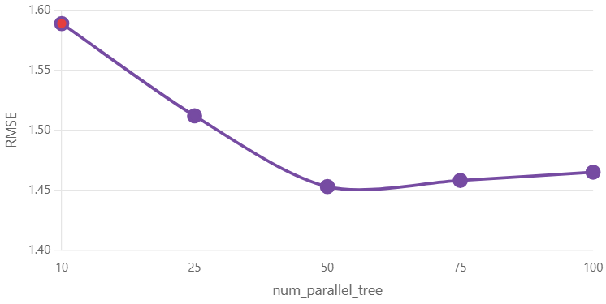
    <br/>
    <em>Number of Trees Hyperparameter Sensitivity</em>
  </p>

  <p align="center">
    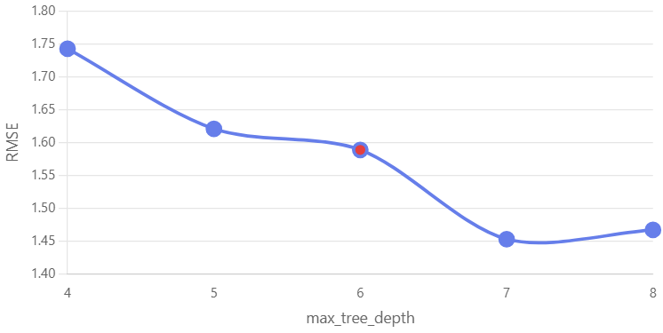
    <br/>
    <em>Tree Depth Hyperparameter Sensitivity</em>
  </p>

  <p align="center">
    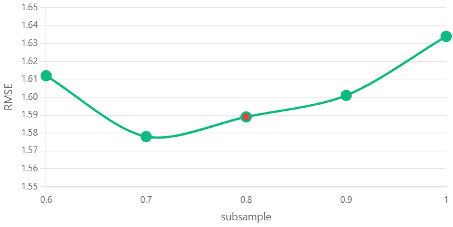
    <br/>
    <em>Subsample Ratio Hyperparameter Sensitivity</em>
  </p>

  <p align="center">
    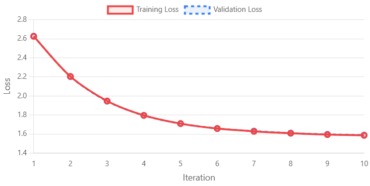
    <br/>
    <em>Training Progress and Convergence</em>
  </p>
</div>

**Key Findings for Boosted Tree:**

- **Optimal Number of Trees**: Found to be in the range that balances bias and variance without overfitting
- **Tree Depth**: Moderate depth provides best generalization performance
- **Subsample Ratio**: Lower subsample ratios help prevent overfitting while maintaining model performance
- **Training Convergence**: Model shows stable convergence with selected hyperparameters

#### Matrix Factorization Hyperparameter Sensitivity

The Matrix Factorization model's performance depends on factorization parameters and regularization:

1. **Number of Factors** - Controls the dimensionality of the latent feature space
2. **L2 Regularization** - Prevents overfitting by penalizing large parameter values
3. **Number of Iterations** - Determines training duration and convergence

<div>
  <p align="center">
    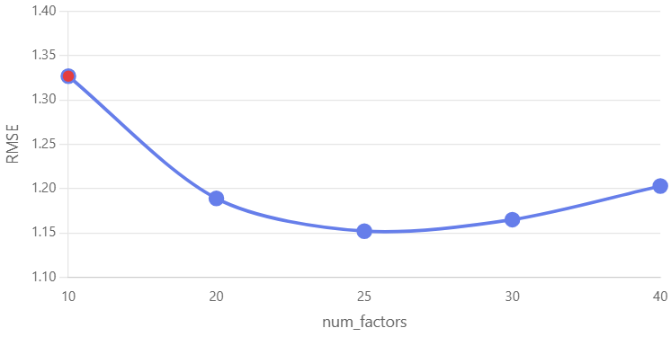
    <br/>
    <em>Number of Factors Hyperparameter Sensitivity</em>
  </p>

  <p align="center">
    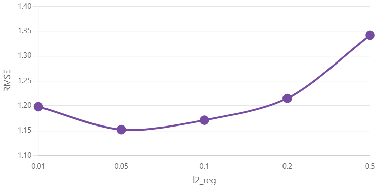
    <br/>
    <em>L2 Regularization Hyperparameter Sensitivity</em>
  </p>

  <p align="center">
    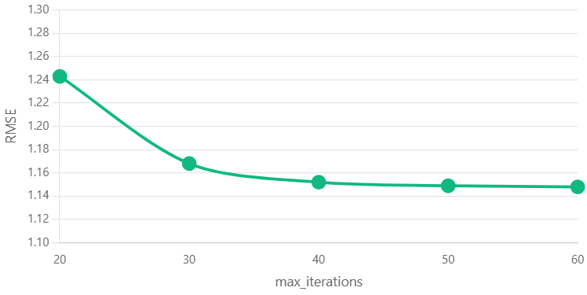
    <br/>
    <em>Number of Iterations Hyperparameter Sensitivity</em>
  </p>
</div>

**Key Findings for Matrix Factorization:**

- **Optimal Number of Factors**: Moderate factor count provides best balance between model expressiveness and generalization
- **L2 Regularization**: Appropriate regularization strength prevents overfitting while maintaining recommendation quality
- **Iterations**: Model converges efficiently with optimal iteration count
- **Performance Trade-offs**: Clear trade-offs between model complexity and prediction accuracy identified

These sensitivity analyses informed our final hyperparameter selections, ensuring optimal model performance while maintaining computational efficiency.

### Model Selection

**Module:** [`src/model_selector.py`](src/model_selector.py)

**Purpose:** Balances validation accuracy with fairness scores to pick the best candidate model.

**Functionality:**
- Compares multiple candidate models based on both performance metrics and fairness scores
- Uses weighted scoring with configurable weights for performance vs. fairness
- Enforces minimum fairness requirements
- Generates model selection reports

**Selection Criteria:**
- **Performance Metrics**: RMSE, MAE, and R² scores
- **Fairness Scores**: Equity indices across all dimensions
- **Weighted Scoring**: Configurable weights for performance vs. fairness
- **Threshold Enforcement**: Minimum fairness requirements

The selected model balances accuracy with fairness, ensuring both high-quality recommendations and equitable treatment across all user and book segments.

## Code for Model Validation

**Module:** [`src/model_validation.py`](src/model_validation.py)

**Purpose:** Validates trained models against performance thresholds and ensures they meet deployment criteria.

**Functionality:**
- Runs ML.EVALUATE on train/val/test splits
- Checks RMSE thresholds
- Validates performance metrics meet requirements
- Persists validation reports in JSON format
- Enforces quality gates before deployment

### GitHub Actions Workflow

**Workflow:** [`6_model_validation.yml`](.github/workflows/6_model_validation.yml)

**Trigger:** Automatically runs after "5. Bias Detection & Mitigation Pipeline" completes successfully

**Steps:**

1. **Checkout repository** - Retrieves code
2. **Set up Python 3.11** - Configures environment
3. **Authenticate to Google Cloud** - Sets up GCP access
4. **Install dependencies** - Installs required packages
5. **Validate model** - This step:
   - Starts MLflow UI server in the background
   - Waits for MLflow server readiness
   - Executes `src.model_validation` which:
     - Runs ML.EVALUATE on train/val/test splits
     - Checks RMSE thresholds
     - Validates performance metrics meet requirements
     - Persists validation reports in JSON format
     - Enforces quality gates before deployment
   - Cleans up MLflow server
6. **Commit and push new files** - Commits validation reports to `artifacts_bot` branch
7. **Notifications** - Sends success/failure notifications

**Key Features:**
- **Quality Gates**: Enforces minimum performance thresholds
- **Multi-Split Validation**: Validates on train, validation, and test sets
- **Automated Blocking**: Prevents deployment if validation fails

**Output Artifacts:**
- Validation reports (JSON)
- MLflow logged validation metrics
- Artifacts committed to `artifacts_bot` branch

**Validation Criteria:**
- RMSE must be below threshold
- MAE must meet requirements
- Performance must be consistent across splits

**Next Workflow:** Automatically triggers "7. Model Manager" on success

## Code for Bias Checking

**Module:** [`src/bias_detection.py`](src/bias_detection.py)

**Purpose:** Computes slice-aware performance metrics, disparity summaries, and mitigation recommendations.

**Functionality:**
- Analyzes model predictions across multiple demographic slices
- Computes performance metrics (MAE, RMSE) per slice
- Identifies performance disparities
- Generates bias detection reports

### Bias Detection Process

The detection system uses a **slice-based analysis** approach:

#### 1. Slice Metrics Computation

For each dimension, the system:

- **Splits predictions** into groups based on the dimension (e.g., High/Medium/Low popularity)
- **Computes performance metrics** for each slice:

  - **MAE (Mean Absolute Error)** - Average prediction error per slice
  - **RMSE (Root Mean Squared Error)** - Penalizes larger errors
  - **Mean Predicted vs. Actual** - Identifies systematic over/under-prediction
  - **Error Distribution** - Mean and standard deviation of errors

#### 2. Disparity Analysis

The system identifies bias by analyzing:

- **Coefficient of Variation (CV)** - Measures relative variability of MAE across slices
  - High CV (>0.2) indicates significant disparity
- **Range Analysis** - Compares best vs. worst performing slices
- **Statistical Significance** - Identifies slices with statistically different performance

#### 3. High-Risk Slice Identification

Slices are flagged as high-risk if they:

- Have MAE significantly above the global average
- Show systematic over/under-prediction patterns
- Have high error variance relative to other slices

### Bias Dimensions Analyzed

The system analyzes bias across **8 key dimensions** to ensure fair recommendations:

1. **Book Popularity** - High/Medium/Low popularity groups (based on `book_popularity_normalized`)
2. **Book Length** - Categories based on `book_length_category` (Short/Medium/Long)
3. **Book Era** - Publication era groups (`book_era`)
4. **Genre Diversity** - Multi-genre vs. single-genre books
5. **User Activity Level** - High/Medium/Low activity user groups (based on `user_activity_count`)
6. **Reading Pace** - Fast/Medium/Slow reader categories (`reading_pace_category`)
7. **Author Gender** - Male/Female author groups (`author_gender_group`)
8. **Rating Range** - High (4-5)/Medium (3-4)/Low (1-3) actual rating groups

### Bias Pipeline

**Module:** [`src/bias_pipeline.py`](src/bias_pipeline.py)

**Purpose:** End-to-end orchestrator that stitches detection, mitigation, visualization, and reporting steps.

**Functionality:**
- Runs complete bias audit pipeline
- Detects bias across all dimensions
- Applies mitigation techniques if needed
- Generates comprehensive reports and visualizations
- Validates mitigation effectiveness

### GitHub Actions Workflow

**Workflow:** [`5_run_bias_pipeline.yml`](.github/workflows/5_run_bias_pipeline.yml)

**Trigger:** Automatically runs after "4. Evaluate Model" completes successfully

**Steps:**

1. **Checkout repository** - Retrieves code
2. **Set up Python 3.11** - Configures environment
3. **Authenticate to Google Cloud** - Sets up GCP access
4. **Install dependencies** - Installs required packages
5. **Run Bias Detection & Mitigation Pipeline** - Executes `src.bias_pipeline` which:
   - **Bias Detection**: Analyzes predictions across 8 dimensions
   - **Disparity Analysis**: Computes MAE, RMSE, and fairness metrics per slice
   - **Mitigation Application**: Applies prediction shrinkage or other techniques if bias detected
   - **Validation**: Re-evaluates models post-mitigation
   - **Visualization Generation**: Creates fairness scorecards, heatmaps, and comparison charts
   - **Model Selection**: Compares models and selects best based on performance + fairness
   - **Report Generation**: Creates comprehensive audit reports
6. **Commit and push new files** - Commits all bias reports and visualizations to `artifacts_bot` branch
7. **Notifications** - Sends email notifications

**Key Features:**
- **Comprehensive Bias Analysis**: 8 dimensions analyzed simultaneously
- **Automated Mitigation**: Applies mitigation techniques when bias is detected
- **Rich Visualizations**: Generates multiple visualization types for stakeholder review
- **Model Selection**: Balances accuracy with fairness

**Output Artifacts:**
- Bias detection reports in `docs/bias_reports/`
- Comprehensive audit reports
- Visualizations in `docs/bias_reports/visualizations/`
- Model selection report and comparison chart
- Pipeline logs in `docs/bias_reports/bias_pipeline_logs/`
- All artifacts committed to `artifacts_bot` branch

**Next Workflow:** Automatically triggers "6. Model Validation" on success

### Mitigation Techniques

When bias is detected, the system applies appropriate mitigation techniques:

#### 1. Prediction Shrinkage (Primary Method)

**Module:** [`src/bias_mitigation.py`](src/bias_mitigation.py)

**How it works:**

- Pulls group-specific prediction means toward the global mean
- Formula: `prediction_debiased = original_prediction - λ * (group_mean - global_mean)`
- Lambda (λ) parameter controls shrinkage strength (default: 0.3-0.5)

**When used:**

- Most effective for Book Era bias (temporal disparities)
- Applied directly to predictions without retraining
- Fast and production-ready

**Benefits:**

- Reduces extreme group differences
- Preserves overall model accuracy
- Maintains relative ordering within groups

#### 2. Threshold Adjustment

**How it works:**

- Applies different decision thresholds per group
- Adjusts prediction boundaries to balance performance

**When used:**

- For dimensions with clear threshold-based disparities
- When shrinkage alone is insufficient

#### 3. Re-weighting (Training-time)

**How it works:**

- Adjusts training sample weights to balance group representation
- Uses inverse propensity or balanced weighting strategies

**When used:**

- For severe bias requiring retraining
- When multiple dimensions show significant disparities

## Code for Model Selection after Bias Checking

**Module:** [`src/model_selector.py`](src/model_selector.py)

**Purpose:** Balances validation accuracy with fairness scores to pick the best candidate model after bias checking and mitigation.

**Functionality:**
- Compares multiple candidate models based on both performance metrics and fairness scores
- Uses weighted scoring with configurable weights for performance vs. fairness
- Enforces minimum fairness requirements
- Generates model selection reports

**Selection Criteria:**

- **Performance Metrics**: RMSE, MAE, and R² scores
- **Fairness Scores**: Equity indices across all dimensions
- **Weighted Scoring**: Configurable weights for performance vs. fairness
- **Threshold Enforcement**: Minimum fairness requirements

The selected model balances accuracy with fairness, ensuring both high-quality recommendations and equitable treatment across all user and book segments.

**Model Selection Report:**

The detailed selection decision is documented in [`model_selection_report.json`](docs/bias_reports/model_selection_report.json), which includes:
- Candidate model scores
- Selection rationale
- Performance and fairness trade-offs
- Final model recommendation

### Model Selection Comparison

The model selection process compares multiple candidate models based on both performance metrics and fairness scores. The comparison chart visualizes the trade-offs between accuracy and fairness:

<div>
  <p align="center">
    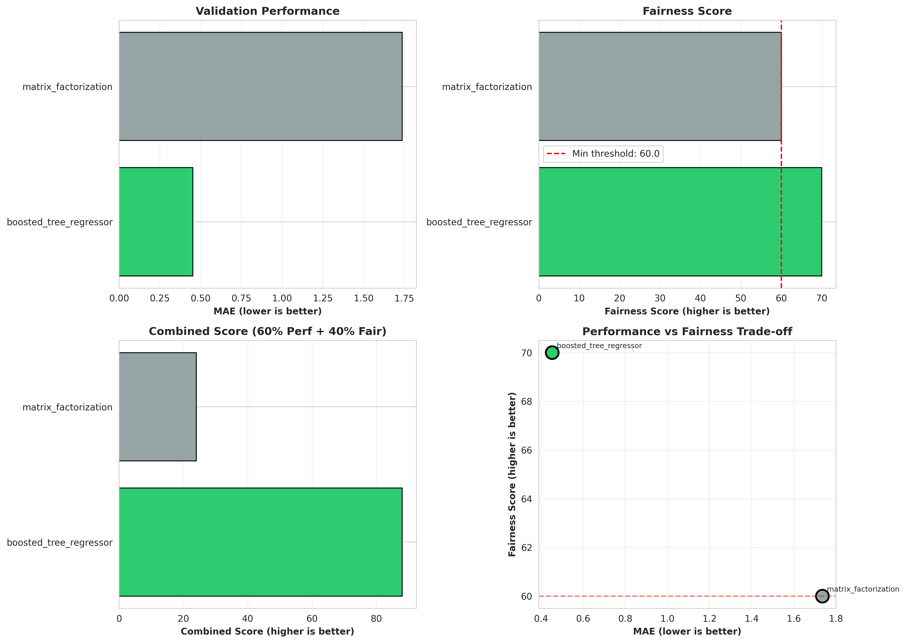
    <br/>
    <em>Model Selection Comparison - Performance vs. Fairness Trade-offs</em>
  </p>
</div>

## Code to Push Model to Artifact Registry/Model Registry

### Model Registration

**Module:** [`src/register_bqml_models.py`](src/register_bqml_models.py)

**Purpose:** Uploads the latest BQML artifacts into the Vertex AI Model Registry with version control.

**Functionality:**
- Registers trained models in Vertex AI Model Registry
- Manages model versioning
- Stores model metadata
- Enables model deployment tracking

### Model Management

**Module:** [`src/model_manager.py`](src/model_manager.py)

**Purpose:** Compares new Vertex AI versions to the current default and promotes/rolls back based on RMSE deltas.

**Functionality:**
- Compares new model version with current default
- Calculates RMSE deltas
- Decides whether to promote or roll back
- Updates default model version in Vertex AI Model Registry
- Manages model versioning and metadata

### GitHub Actions Workflow

**Workflow:** [`7_model_manager.yml`](.github/workflows/7_model_manager.yml)

**Trigger:** Automatically runs after "6. Model Validation" completes successfully

**Steps:**

1. **Checkout repository** - Retrieves code
2. **Set up Python 3.11** - Configures environment
3. **Authenticate to Google Cloud** - Sets up GCP access
4. **Install dependencies** - Installs required packages
5. **Manage the default model version** - This step:
   - Starts MLflow UI server in the background
   - Waits for MLflow server readiness
   - Executes `src.model_manager` which:
     - Compares new model version with current default
     - Calculates RMSE deltas
     - Decides whether to promote or roll back
     - Updates default model version in Vertex AI Model Registry
     - Manages model versioning and metadata
   - Cleans up MLflow server
6. **Commit and push new files** - Commits version management artifacts to `artifacts_bot` branch
7. **Notifications** - Sends success/failure notifications

**Key Features:**
- **Automated Promotion**: Promotes models that improve performance
- **Rollback Protection**: Prevents regression by comparing with current production
- **Version Control**: Integrates with Vertex AI Model Registry
- **Delta-Based Decisions**: Uses RMSE deltas to make promotion decisions

**Output Artifacts:**
- Model version management records
- Promotion/rollback decisions
- Artifacts committed to `artifacts_bot` branch

**Promotion Logic:**
- New model must have RMSE improvement (or within acceptable threshold)
- Fairness scores must meet minimum requirements
- Validation must have passed in previous step

## Experiment Tracking and Results

### MLflow Integration

Our pipeline uses MLflow for comprehensive experiment tracking:

- **Automatic MLflow Server Management**: MLflow UI server is automatically started and managed during training, evaluation, and validation workflows
- **Metrics Logging**: All performance metrics (MAE, RMSE, R², accuracy) are logged to MLflow
- **Parameter Tracking**: Hyperparameters and model configurations are tracked
- **Artifact Storage**: Model artifacts and evaluation reports are stored in MLflow
- **Experiment Comparison**: Easy comparison of different model runs and hyperparameter configurations

### Model Analysis Artifacts

**Location:** `docs/model_analysis/`

Complementing the bias reports, `docs/model_analysis/` captures performance-centric evaluations so data scientists can answer "how accurate?" and "why?" in one place:

| Subfolder / File | Produced By | What It Contains & Why It Matters |
|------------------|-------------|-----------------------------------|
| `evaluation/` | `model_evaluation_pipeline.py` | JSON reports such as [`boosted_tree_regressor_evaluation_report.json`](docs/model_analysis/evaluation/boosted_tree_regressor_evaluation_report.json) that store run metadata, MAE/RMSE/correlation statistics, accuracy-within-Δ buckets, and pointers to any sensitivity analysis outputs. These files give product owners a single source of truth for offline performance. |
| `sensitivity/` | `model_sensitivity_analysis.py` | SHAP analysis artifacts (JSON summaries plus PNG charts referenced in docs). Each JSON (e.g., [`test-model_feature_importance.json`](docs/model_analysis/sensitivity/test-model_feature_importance.json)) lists feature importance scores, categorical encodings, sample sizes, and file paths for the generated plots, enabling explainability reviews without rerunning SHAP. |

#### Evaluation JSON Schema

Every JSON inside `docs/model_analysis/evaluation/` follows a consistent schema:

```json
{
  "model_name": "boosted_tree_regressor",
  "timestamp": "2025-01-15T04:27:13.829410",
  "predictions_table": "project.books.boosted_tree_rating_predictions",
  "performance_metrics": {
    "num_predictions": 12456,
    "mae": 0.6123,
    "rmse": 0.8124,
    "r_squared": 0.54,
    "accuracy_within_0_5_pct": 62.1,
    "accuracy_within_1_0_pct": 88.8,
    "accuracy_within_1_5_pct": 97.4,
    "mean_predicted": 3.84,
    "mean_actual": 3.79,
    "std_error": 0.41
  },
  "sensitivity_analysis": {
    "artifact_path": "../docs/model_analysis/sensitivity/boosted_tree_regressor_feature_importance.json",
    "top_features": [
      {"feature": "book_popularity_normalized", "importance": 0.142},
      {"feature": "user_activity_count", "importance": 0.117}
    ]
  }
}
```

#### Sensitivity Analysis JSON Schema

Every JSON inside `docs/model_analysis/sensitivity/` follows a consistent schema for feature importance analysis:

```json
{
  "model_name": "test-model",
  "timestamp": "2025-11-17T04:53:33.161052",
  "sample_size": 100,
  "feature_importance": [
    {
      "feature": "num_genres",
      "importance": 0.225
    },
    {
      "feature": "book_popularity_normalized",
      "importance": 0.125
    }
  ],
  "categorical_mappings": {}
}
```

### Bias Reporting Artifacts

**Location:** `docs/bias_reports/`

Bias analysis is treated as a first-class deliverable. Everything the bias pipeline emits is organized under `docs/bias_reports/`, making it easy for reviewers to trace fairness conclusions without re-running notebooks:

| Artifact | Produced By | Detailed Contents & Intended Use |
|----------|-------------|----------------------------------|
| `*_detection_report.json` | `bias_detection.py` | For each model/dataset pair we persist the exact slice metrics (MAE, RMSE, counts, mean error), the disparity summary per dimension, the list of high-risk slices, and the auto-generated recommendations. Example: [`boosted_tree_regressor_detection_report.json`](docs/bias_reports/boosted_tree_regressor_detection_report.json). These JSONs are ingested by dashboards and also used later when comparing mitigation effectiveness. |
| `*_mitigation_report.json` | `bias_mitigation.py` | Captures before/after metrics for the specific technique that ran (shrinkage, threshold adjustment, re-weighting). Includes parameter choices (e.g., lambda, threshold deltas), improvement percentages, and the BigQuery table where debiased predictions were written, so QA can reproduce results. |
| `*_comprehensive_audit.json` | `bias_pipeline.py` | Serves as the executive summary for a full run: metadata about the audit, detection highlights, which mitigation steps executed, validation re-checks, and an executive summary block with pass/mitigated/needs-attention status. Example: [`boosted_tree_regressor_comprehensive_audit.json`](docs/bias_reports/boosted_tree_regressor_comprehensive_audit.json). This is what we attach to compliance reviews. |
| `bias_pipeline_logs/` | `bias_pipeline.py` CLI / Airflow task | Raw stdout/stdio logs captured with timestamps, showing every step, warning, and recommendation printed during the run. These logs are critical when investigating why a mitigation was skipped or why BigQuery jobs failed. |
| `visualizations/` | `bias_visualization.py` | Collection of PNGs referenced in reports: fairness scorecard gauges, disparity heatmaps, per-dimension bar charts, before/after comparisons, etc. Each filename embeds the model name and slice to simplify embedding in slide decks. |
| `model_selection/` | `model_selector.py` | Stores [`model_selection_report.json`](docs/bias_reports/model_selection_report.json) (combined performance + fairness scoring), along with charts such as `model_comparison.png` so stakeholders can visually inspect the trade-offs the selector considered. |
| `model_selection_report.json` (root copy) | `model_selector.py` | Latest snapshot of the selection decision for downstream automation (e.g., `model_manager.py` and `model_validation.py` read this file to know which table to promote or validate). |

### Bias Reports and Visualizations

The bias detection and mitigation pipeline generates comprehensive reports and visualizations that provide insights into model fairness across all analyzed dimensions.

#### Fairness Scorecards

Fairness scorecards provide an at-a-glance view of model fairness across all dimensions. Each scorecard shows:

- Overall fairness score
- Per-dimension fairness indicators
- High-risk slice identification
- Quick pass/fail status

<div>
  <p align="center">
    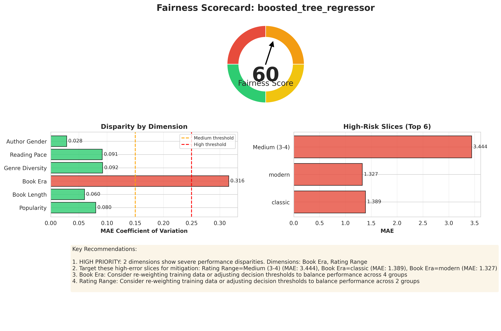
    <br/>
    <em>Boosted Tree Regressor Fairness Scorecard</em>
  </p>

  <p align="center">
    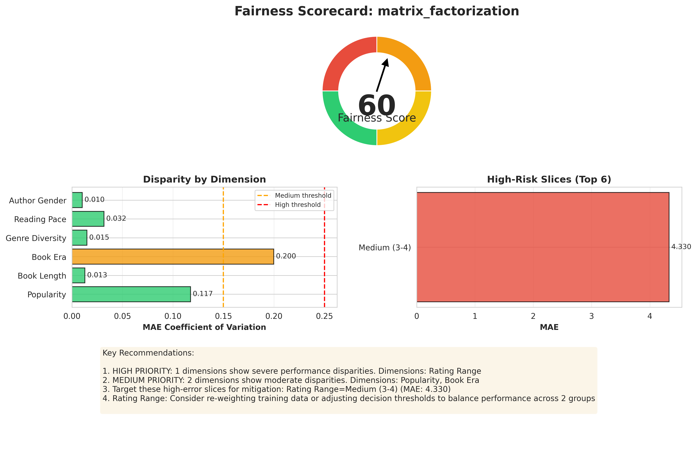
    <br/>
    <em>Matrix Factorization Fairness Scorecard</em>
  </p>
</div>

#### Disparity Heatmaps

Disparity heatmaps visualize performance disparities across all dimensions and slices, making it easy to identify patterns and outliers:

<div>
  <p align="center">
    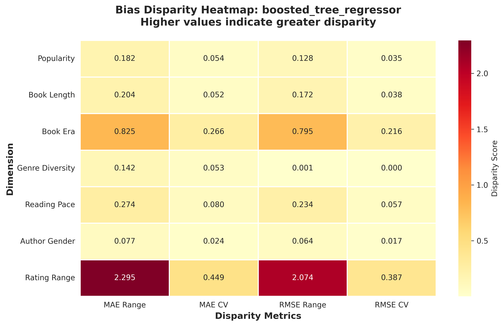
    <br/>
    <em>Boosted Tree Regressor Disparity Heatmap</em>
  </p>

  <p align="center">
    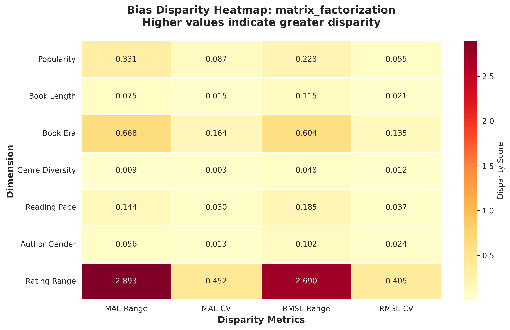
    <br/>
    <em>Matrix Factorization Disparity Heatmap</em>
  </p>
</div>

#### Per-Dimension MAE Comparisons

Detailed per-dimension comparisons show how model performance varies across different slices within each dimension. These visualizations help identify specific areas where bias mitigation is needed.

**Boosted Tree Regressor - Dimension Comparisons:**

<div>
  <p align="center">
    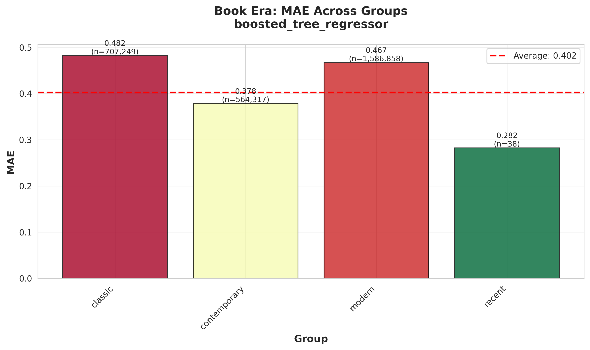
    <br/>
    <em>Book Era Dimension - MAE Comparison</em>
  </p>

  <p align="center">
    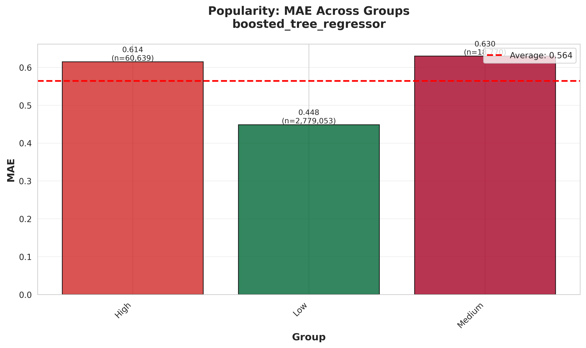
    <br/>
    <em>Popularity Dimension - MAE Comparison</em>
  </p>

  <p align="center">
    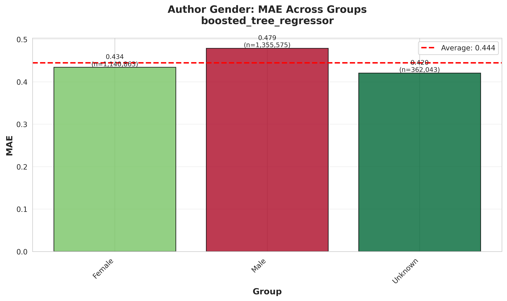
    <br/>
    <em>Author Gender Dimension - MAE Comparison</em>
  </p>

  <p align="center">
    
    <br/>
    <em>User Activity Dimension - MAE Comparison</em>
  </p>
</div>

**Matrix Factorization - Dimension Comparisons:**

<div>
  <p align="center">
    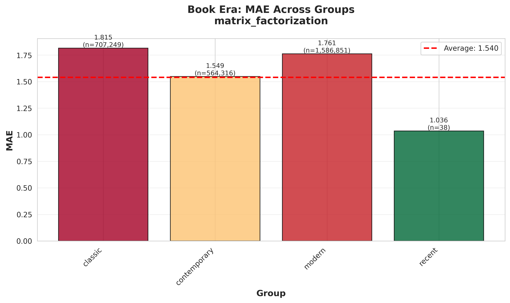
    <br/>
    <em>Book Era Dimension - MAE Comparison</em>
  </p>

  <p align="center">
    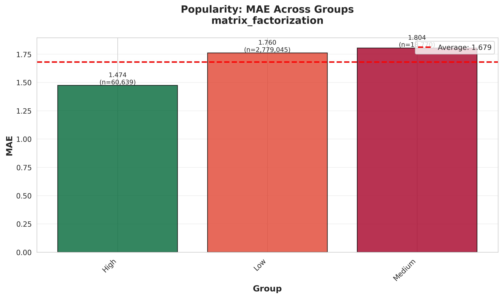
    <br/>
    <em>Popularity Dimension - MAE Comparison</em>
  </p>

  <p align="center">
    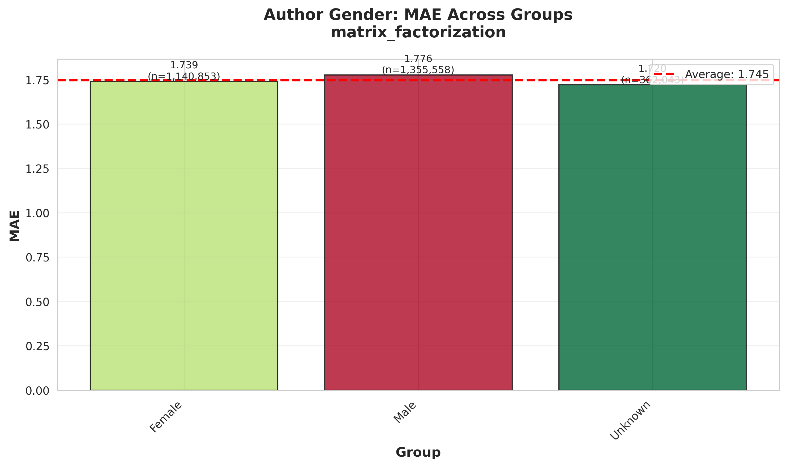
    <br/>
    <em>Author Gender Dimension - MAE Comparison</em>
  </p>
</div>

**Additional Dimension Visualizations:**

All 8 dimensions are visualized for both models. Additional comparisons include:
- Book Length comparisons
- Genre Diversity comparisons
- Reading Pace comparisons
- Rating Range comparisons

Visualization files are stored in [`docs/bias_reports/visualizations/`](docs/bias_reports/visualizations/) and follow the naming pattern: `{model_name}_{dimension}_mae_comparison.png`

### Core ML Pipeline Modules

> **Note:** For the complete folder structure, please refer to [README_data.md](README_data.md#folder-structure). The following section focuses on ML-specific modules.

The `src/` directory groups together the reusable services that orchestrate model training, fairness analysis, and deployment. Each module is designed to be imported by Airflow DAGs, CLI utilities, or notebooks:

| Module | Purpose |
|--------|---------|
| `src/__init__.py` | Exposes the public package surface so DAGs/notebooks can import shared helpers without deep relative paths. |
| `src/load_data.py` | Bootstraps BigQuery credentials and returns the curated train split as either BigFrames or pandas DataFrames. |
| `src/df_model_training.py` | Lightweight, in-memory training stub for experimentation and CI smoke tests using pandas data. |
| `src/bq_model_training.py` | Production BigQuery ML training workflow with concurrency handling, MLflow logging, and evaluation hooks. |
| `src/generate_prediction_tables.py` | Builds bias-ready prediction tables (features + inferred slices) for every trained model. |
| [`src/bias_detection.py`](src/bias_detection.py) | Computes slice-aware performance metrics, disparity summaries, and mitigation recommendations. |
| [`src/bias_mitigation.py`](src/bias_mitigation.py) | Implements shrinkage, threshold adjustment, and re-weighting strategies to reduce detected bias. |
| [`src/bias_pipeline.py`](src/bias_pipeline.py) | End-to-end orchestrator that stitches detection, mitigation, visualization, and reporting steps. |
| [`src/bias_visualization.py`](src/bias_visualization.py) | Generates fairness scorecards, disparity heatmaps, and slice comparison plots for reports. |
| `src/model_selector.py` | Balances validation accuracy with fairness scores to pick the best candidate model. |
| `src/model_manager.py` | Compares new Vertex AI versions to the current default and promotes/rolls back based on RMSE deltas. |
| [`src/model_evaluation_pipeline.py`](src/model_evaluation_pipeline.py) | Logs MAE/RMSE, computes SHAP-based feature importance, and exports evaluation artifacts. |
| [`src/model_sensitivity_analysis.py`](src/model_sensitivity_analysis.py) | Provides SHAP helpers and visualizations to explain feature impact across models. |
| `src/model_validation.py` | Runs ML.EVALUATE on train/val/test splits, enforces RMSE thresholds, and persists JSON reports. |
| `src/register_bqml_models.py` | Uploads the latest BQML artifacts into the Vertex AI Model Registry with version control. |

> **Note:** For Data Analysis & Insights and Project Visuals, please refer to [README_data.md](README_data.md#data-analysis--insights).
