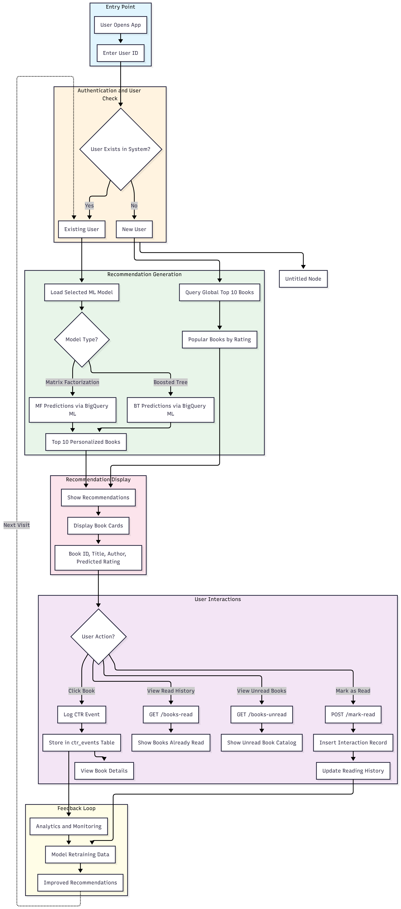
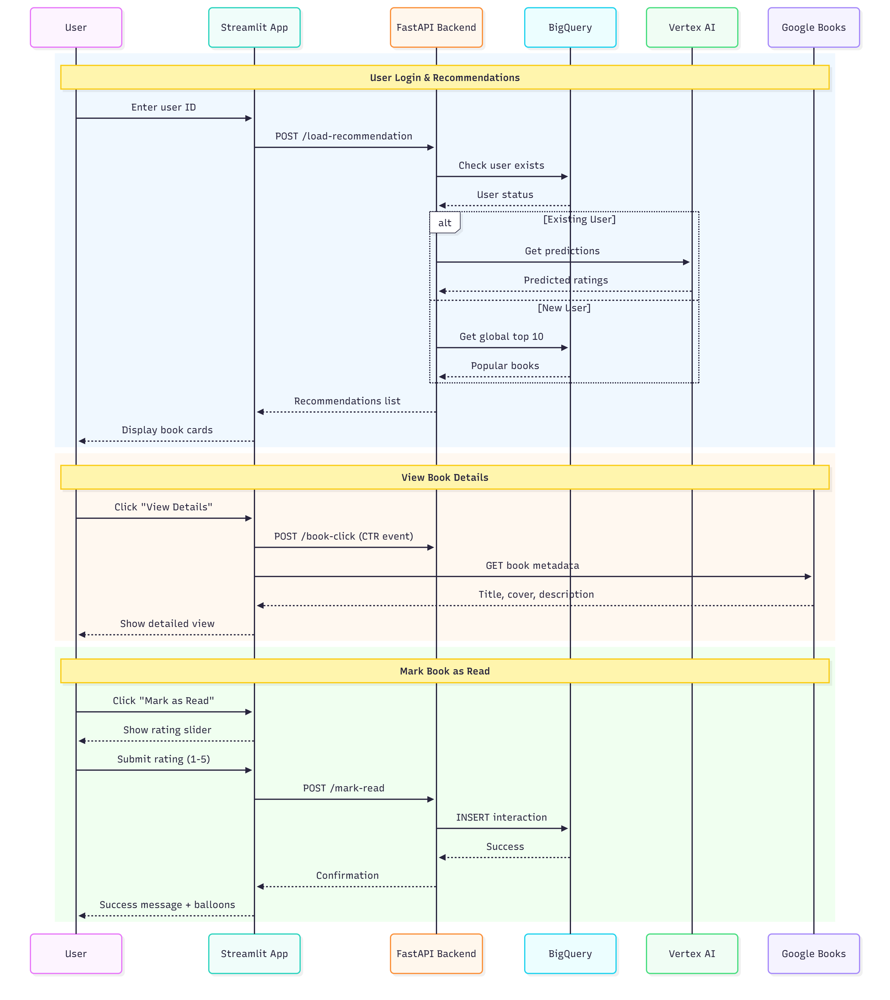
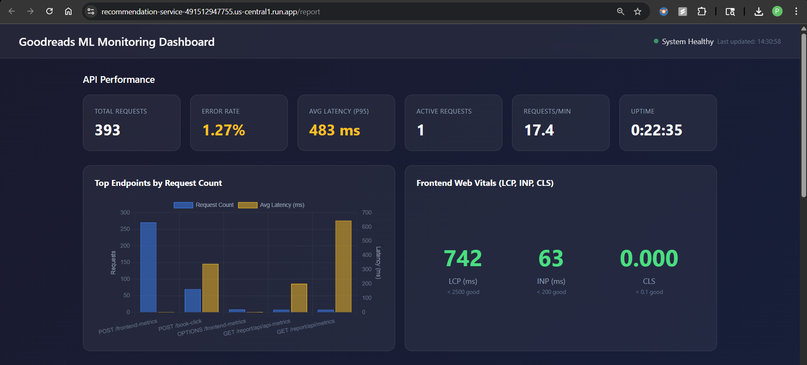
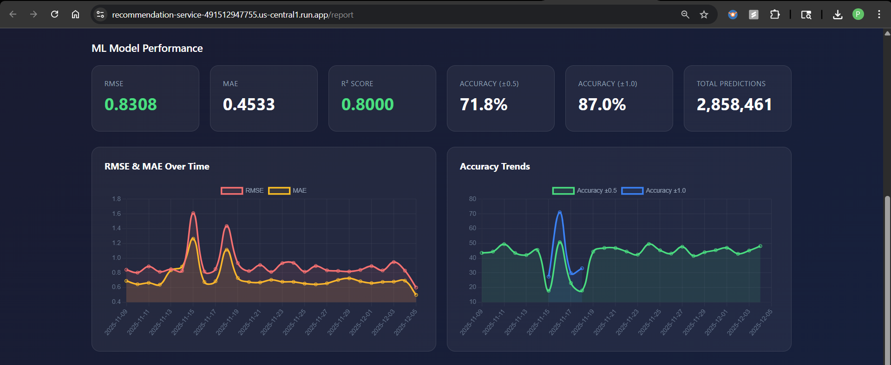
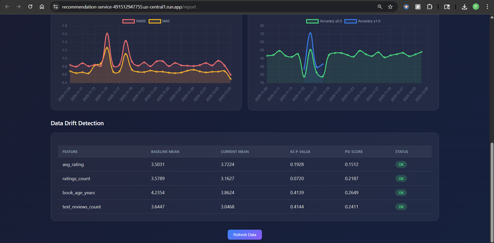

# Frontend Deployment Guide

This guide covers the Streamlit-based frontend application for the Goodreads Book Recommendation System.

## Table of Contents

- [Overview](#overview)
- [System Architecture](#system-architecture)
- [Project Structure](#project-structure)
- [Quick Start](#quick-start)
- [Application Flow](#application-flow)
- [Features](#features)
- [API Integration](#api-integration)
- [Configuration](#configuration)
- [Deployment](#deployment)
- [Monitoring & Observability](#monitoring--observability)
- [Troubleshooting](#troubleshooting)
- [Development Guide](#development-guide)
- [Related Documentation](#related-documentation)

---

## Overview

The frontend is a **Streamlit** application that provides a rich, interactive interface for the book recommendation system. It enables users to:

- **Get Personalized Recommendations**: ML-powered book suggestions based on reading history
- **Search Books**: Find and explore books from the catalog
- **Manage Reading List**: Track read/unread books and rate completed reads
- **Monitor Performance**: Access API and model metrics (admin)

### Key Capabilities

| Feature | Description |
|---------|-------------|
| Personalized Recommendations | Top-10 ML-predicted books per user |
| Book Search | Title/author search with Google Books enrichment |
| User History | Read books tracking with ratings |
| CTR Tracking | Click-through rate monitoring for model improvement |
| Web Vitals | Core Web Vitals performance monitoring |
| Admin Dashboard | API performance and model metrics |

---

## System Architecture

### Component Diagram

```
+----------------------+      +----------------------+      +----------------------+
|   Streamlit App      |----->|   FastAPI Backend    |----->|   BigQuery ML        |
|   (Cloud Run)        |      |   (Cloud Run)        |      |   (Predictions)      |
|   Port: 8501         |      |   Port: 8080         |      |                      |
+----------------------+      +----------------------+      +----------------------+
         |                              |                            |
         |                              |                            |
         v                              v                            v
+----------------------+      +----------------------+      +----------------------+
| Google Books API     |      | Vertex AI Endpoint   |      | User Interactions    |
| (Book Metadata)      |      | (Model Serving)      |      | (CTR Events)         |
+----------------------+      +----------------------+      +----------------------+
```

---

## Project Structure

```
goodreads_recommendations/
├── pages/
│   ├── app/
│   │   ├── __init__.py
│   │   ├── book_recommendation_app.py    # Main Streamlit application
│   │   └── monitoring_page.py            # Admin monitoring dashboard
│   ├── data/
│   │   └── books_database.json           # Local books catalog
│   └── requirements.txt                   # Frontend dependencies
│
├── api/
│   ├── main.py                            # FastAPI backend entry point
│   ├── data_models.py                     # Pydantic request/response models
│   ├── queries.py                         # BigQuery query functions
│   ├── middleware.py                      # Monitoring middleware
│   ├── monitoring_dashboard.py            # Admin dashboard routes
│   └── requirements.txt                   # Backend dependencies
│
├── Dockerfile.frontend                    # Frontend container configuration
├── docker-compose.yaml                    # Multi-service orchestration
└── .github/workflows/
    └── deploy_frontend.yml               # CI/CD workflow
```

---

## Quick Start

### Prerequisites

- Python 3.11+
- Docker (for containerized deployment)
- GCP credentials (for Cloud Run deployment)

### Local Development

1. **Clone the repository**:
   ```bash
   git clone https://github.com/purva-agarwal/goodreads_recommendations.git
   cd goodreads_recommendations
   ```

2. **Install dependencies**:
   ```bash
   pip install streamlit requests pandas
   ```

3. **Run the application**:
   ```bash
   streamlit run pages/app/book_recommendation_app.py
   ```

4. **Access the app**: Open http://localhost:8501

### Docker Deployment

1. **Build the image**:
   ```bash
   docker build -f Dockerfile.frontend -t recommendation-frontend .
   ```

2. **Run the container**:
   ```bash
   docker run -p 8501:8501 recommendation-frontend
   ```

3. **Access the app**: Open http://localhost:8501

---

## Application Flow

### User Journey Flowchart



### Request-Response Sequence



---

## Features

### 1. Book Recommendations

The main page provides personalized book suggestions:

```python
# Recommendation flow
1. User enters/selects user ID
2. System checks if user exists in BigQuery
3. For existing users: Query Vertex AI for predicted ratings
4. For new users: Return global top-10 popular books
5. Display recommendations as interactive cards
6. Track "view" events for CTR monitoring
```

**Card Display:**
- Book title and author
- Predicted rating (ML model output)
- "View Details" button with click tracking

### 2. Book Search

Users can search the local book database:

- **Search by**: Title or author name
- **Results**: Up to 20 matching books
- **Indicators**: Shows if book is already read
- **Integration**: Google Books API for rich metadata

### 3. Book Details View

Detailed information pulled from Google Books API:

| Field | Source |
|-------|--------|
| Cover Image | Google Books |
| Description | Google Books |
| Page Count | Google Books |
| Categories | Google Books |
| Rating | ML Model (primary) / Google Books (fallback) |
| Preview Link | Google Books |

### 4. User Actions

| Action | CTR Event Type | Storage |
|--------|----------------|---------|
| View recommendation | `view` | BigQuery |
| Click book details | `click` | BigQuery |
| Like book | `like` | BigQuery |
| Add to reading list | `add_to_list` | BigQuery |
| Mark as read | `rating` | BigQuery interactions table |

### 5. Admin Monitoring

Access via Admin button with credentials (`admin/admin`):

- API performance metrics (latency, error rates)
- Model performance indicators
- Data drift detection status
- Real-time dashboard at `/report`

### 6. Web Vitals Tracking

Automatic Core Web Vitals monitoring:

| Metric | Description | Good Threshold |
|--------|-------------|----------------|
| LCP | Largest Contentful Paint | < 2.5s |
| FCP | First Contentful Paint | < 1.8s |
| CLS | Cumulative Layout Shift | < 0.1 |
| INP | Interaction to Next Paint | < 200ms |
| TTFB | Time to First Byte | < 800ms |

Metrics are automatically sent to `/frontend-metrics` endpoint.

---

## API Integration

### Backend Endpoints

| Endpoint | Method | Description | Request | Response |
|----------|--------|-------------|---------|----------|
| `/load-recommendation` | POST | Get personalized recommendations | `{user_id: string}` | `{user_id, recommendations[]}` |
| `/books-read/{user_id}` | GET | Get user's read books | - | `{user_id, books_read[]}` |
| `/books-unread/{user_id}` | GET | Get user's unread books | - | `{user_id, books_unread[]}` |
| `/book-click` | POST | Log CTR event | `{user_id, book_id, event_type, book_title}` | `{success: bool}` |
| `/mark-read` | POST | Mark book as read with rating | `{user_id, book_id, rating}` | `{success: bool}` |
| `/frontend-metrics` | POST | Submit Web Vitals data | `{sessionId, metrics{}}` | `{status: "ok"}` |
| `/metrics` | GET | Get API performance metrics | - | `{summary{}, endpoints[]}` |
| `/health` | GET | Health check | - | `{status: "healthy"}` |
| `/report` | GET | Admin monitoring dashboard | Basic Auth | HTML Dashboard |

### Data Models

```python
# Request Models
class RecommendationRequest:
    user_id: str

class ClickEventRequest:
    user_id: str
    book_id: int
    book_title: str
    event_type: str  # "view", "click", "like", "add_to_list"

class MarkReadRequest:
    user_id: str
    book_id: int
    rating: int  # 1-5

# Response Models
class BookRecommendation:
    book_id: int
    title: str
    author: str
    predicted_rating: float

class RecommendationResponse:
    user_id: str
    recommendations: List[BookRecommendation]
```

---

## Configuration

### Environment Variables

| Variable | Description | Default |
|----------|-------------|---------|
| `API_BASE_URL` | Backend API endpoint | `https://recommendation-service-491512947755.us-central1.run.app` |
| `PORT` | Application port | `8501` |

### Changing the Backend API URL

**Option 1: Modify source files**

Update `API_BASE_URL` in:
- `pages/app/book_recommendation_app.py` (line 13)
- `pages/app/monitoring_page.py` (line 17)

**Option 2: Environment variable**

```bash
docker run -p 8501:8501 \
  -e API_BASE_URL=https://your-api.run.app \
  recommendation-frontend
```

### Dockerfile Configuration

```dockerfile
FROM python:3.11-slim

WORKDIR /app
ENV PYTHONUNBUFFERED=1

RUN pip install --no-cache-dir streamlit requests pandas

COPY pages/app ./pages/app
COPY pages/data/books_database.json ./data/books_database.json

ENV PORT=8501
EXPOSE 8501

CMD ["streamlit", "run", "pages/app/book_recommendation_app.py", \
     "--server.port=8501", "--server.address=0.0.0.0", "--server.headless=true"]
```

---

## Deployment

### Cloud Run Deployment (Manual)

1. **Authenticate with GCP**:
   ```bash
   gcloud auth login
   gcloud config set project YOUR_PROJECT_ID
   ```

2. **Configure Docker for Artifact Registry**:
   ```bash
   gcloud auth configure-docker us-central1-docker.pkg.dev
   ```

3. **Build and push the image**:
   ```bash
   IMAGE="us-central1-docker.pkg.dev/YOUR_PROJECT_ID/recommendation-service/recommendation-frontend:latest"
   docker build -f Dockerfile.frontend -t $IMAGE .
   docker push $IMAGE
   ```

4. **Deploy to Cloud Run**:
   ```bash
   gcloud run deploy recommendation-frontend \
     --image $IMAGE \
     --region us-central1 \
     --platform managed \
     --allow-unauthenticated \
     --port 8501
   ```

### Automated Deployment (CI/CD)

The frontend automatically deploys via GitHub Actions `deploy_frontend.yml` when changes are pushed to `master` in:
- `pages/app/**`
- `Dockerfile.frontend`

#### Required GitHub Secrets

| Secret | Description |
|--------|-------------|
| `GCP_CREDENTIALS` | GCP service account JSON key |
| `GCP_PROJECT_ID` | GCP project ID (default: `recommendation-system-475301`) |
| `GCP_REGION` | GCP region (default: `us-central1`) |

---

## Monitoring & Observability

### Performance Dashboard

Access the monitoring dashboard at: `{API_BASE_URL}/report`

**Credentials**: `admin` / `admin`

### Metrics Available







---

## Troubleshooting

### App won't start

**Symptom**: Container exits immediately or Streamlit doesn't load.

**Solutions**:
1. Check if port 8501 is available:
   ```bash
   lsof -i :8501
   ```

2. Verify the Dockerfile entry point:
   ```bash
   docker run -it recommendation-frontend /bin/bash
   streamlit run pages/app/book_recommendation_app.py --server.port=8501
   ```

3. Check container logs:
   ```bash
   docker logs <container_id>
   ```

### Books database warning

**Symptom**: "books_database.json not found, using fallback data"

**Cause**: The Docker image may not have the books database file properly copied.

**Solution**: Verify the file exists and rebuild:
```bash
# Check file exists
ls -la pages/data/books_database.json

# Rebuild image
docker build -f Dockerfile.frontend -t recommendation-frontend . --no-cache
```

### API connection errors

**Symptom**: "Error fetching recommendations" or API timeout errors.

**Solutions**:
1. Verify the backend is running:
   ```bash
   curl https://recommendation-service-491512947755.us-central1.run.app/health
   ```

2. Check CORS configuration on the backend

3. Verify network connectivity from Cloud Run

4. Check API_BASE_URL configuration matches deployed backend

### Monitoring page errors

**Symptom**: Monitoring page fails to load metrics.

**Solutions**:
1. Ensure `pandas` is installed
2. Verify the `/metrics` endpoint is accessible
3. Check the API_BASE_URL configuration

### Rating submission fails

**Symptom**: "Failed to insert read interaction" error.

**Solutions**:
1. Verify BigQuery permissions for the service account
2. Check the `interactions` table exists in BigQuery
3. Verify book_id format matches expected type

---

## Development Guide

### Adding New Pages

1. Create a new `.py` file in `pages/app/`:
   ```python
   import streamlit as st
   
   st.set_page_config(page_title="My Page", page_icon="📚")
   
   st.title("My New Page")
   # Your page content here
   ```

2. Update the sidebar navigation in `book_recommendation_app.py`

3. Rebuild and redeploy the Docker image

### Adding New API Endpoints

1. Define the data model in `api/data_models.py`
2. Add the endpoint in `api/main.py`
3. Add query functions in `api/queries.py` (if needed)
4. Update frontend to call the new endpoint

### Testing Locally with Mock Data

The app includes fallback data for testing without the full database:

```python
def load_fallback_database():
    return [
        {"book_id": "13079104", "title": "Circe", "author": "Madeline Miller", ...},
        {"book_id": "11295686", "title": "Gone Girl", "author": "Gillian Flynn", ...},
    ]
```

### Code Style

- Use type hints for function parameters and returns
- Follow PEP 8 style guidelines
- Use meaningful variable names
- Add docstrings for functions

### Session State Variables

| Variable | Type | Description |
|----------|------|-------------|
| `current_user` | str | Current logged-in user ID |
| `recommendations` | List[Dict] | Current recommendations list |
| `read_books` | List[Dict] | User's read books |
| `selected_book` | Dict | Currently viewed book details |
| `view_mode` | str | Current page state |
| `session_id` | str | Unique session identifier |
| `search_results` | List[Dict] | Current search results |
| `show_rating_modal` | bool | Rating modal visibility |

---

## Related Documentation

- [Project Replication Guide](README_project_replication.md) - Full system setup
- [Main README](README.md) - Complete project overview
- [Data Pipeline](README_data.md) - Data processing documentation
- [Model Training](README_model.md) - ML pipeline documentation

---

**Note**: This frontend is part of an MLOps-ready book recommendation system. For production deployments, ensure all GCP credentials are properly configured and security best practices are followed.