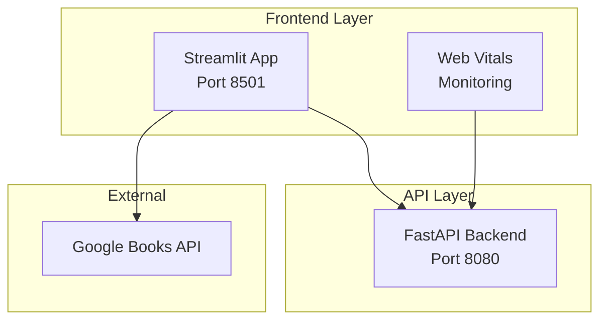
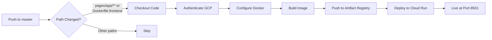

# Project Replication Guide

This document provides detailed instructions for replicating the Goodreads Book Recommendation System on other machines or platforms, covering setup, deployment, and validation.

## Table of Contents
- [Prerequisites](#prerequisites)
- [Step 1: Repository Setup](#step-1-repository-setup)
- [Step 2: GCP Project Configuration](#step-2-gcp-project-configuration)
- [Step 3: Local Environment Setup](#step-3-local-environment-setup)
- [Step 4: Initial Data Setup](#step-4-initial-data-setup)
- [Step 5: Data Pipeline Execution](#step-5-data-pipeline-execution)
- [Step 6: ML Model Pipeline](#step-6-ml-model-pipeline)
- [Step 7: One-Time Setup Scripts](#step-7-one-time-setup-scripts)
- [Step 8: Infrastructure Deployment](#step-8-infrastructure-deployment)
- [Step 9: API Backend Deployment](#step-9-api-backend-deployment)
- [Step 10: Frontend (Streamlit) Deployment](#step-10-frontend-streamlit-deployment)
- [Step 11: CI/CD Setup (GitHub Actions)](#step-11-cicd-setup-github-actions)
- [Step 12: Validation](#step-12-validation)
- [Troubleshooting](#troubleshooting)
- [Platform Migration Notes](#platform-migration-notes)

---

## Prerequisites

Ensure the following tools are installed:

| Tool | Version | Purpose |
|------|---------|---------|
| Python | 3.11+ | Runtime for ML pipelines and API |
| Docker | 20.10+ | Containerization |
| Docker Compose | 2.0+ | Multi-container orchestration |
| Terraform | >= 1.0.0 | Infrastructure as Code |
| gcloud CLI | Latest | GCP interactions |
| Git | 2.30+ | Version control |

---

## Step 1: Repository Setup

### 1.1 Clone the Repository

```bash
git clone https://github.com/purva-agarwal/goodreads_recommendations.git
cd goodreads_recommendations
```

### 1.2 Verify Project Structure

Ensure the following key directories exist:
```
goodreads_recommendations/
├── api/                      # FastAPI backend
├── config/                   # Configuration files and DAGs
│   └── dags/                 # Airflow DAG definitions
├── datapipeline/             # Data processing scripts
│   └── scripts/              # ETL, cleaning, feature engineering
├── src/                      # ML pipeline scripts
├── terraform/                # Infrastructure as Code
├── docker-compose.yaml       # Airflow services
├── docker-compose.model.yaml # ML pipeline services
├── Dockerfile                # Airflow image
├── Dockerfile.model          # ML pipeline image
├── Dockerfile.backend        # API backend image
└── Makefile                  # Automation commands
```

---

## Step 2: GCP Project Configuration

### 2.1 Create or Select GCP Project

```bash
# Create new project (or use existing)
gcloud projects create YOUR_PROJECT_ID --name="Book Recommendations"
gcloud config set project YOUR_PROJECT_ID

# Enable billing (required for most services)
# Visit: https://console.cloud.google.com/billing
```

### 2.2 Enable Required APIs

```bash
gcloud services enable \
    aiplatform.googleapis.com \
    bigquery.googleapis.com \
    run.googleapis.com \
    cloudbuild.googleapis.com \
    artifactregistry.googleapis.com \
    logging.googleapis.com \
    monitoring.googleapis.com
```

### 2.3 Create Service Account

```bash
# Create service account
gcloud iam service-accounts create ml-pipeline-sa \
    --display-name="ML Pipeline Service Account"

# Grant required roles
for role in \
    roles/bigquery.dataEditor \
    roles/bigquery.user \
    roles/aiplatform.user \
    roles/storage.objectViewer \
    roles/logging.logWriter \
    roles/monitoring.metricWriter
do
    gcloud projects add-iam-policy-binding YOUR_PROJECT_ID \
        --member="serviceAccount:ml-pipeline-sa@YOUR_PROJECT_ID.iam.gserviceaccount.com" \
        --role="$role"
done
```

### 2.4 Create and Download Credentials

```bash
# Create key file
gcloud iam service-accounts keys create config/gcp_credentials.json \
    --iam-account=ml-pipeline-sa@YOUR_PROJECT_ID.iam.gserviceaccount.com

# Verify the file was created
ls -la config/gcp_credentials.json
```

### 2.5 Create BigQuery Dataset

```bash
bq mk --dataset --location=US YOUR_PROJECT_ID:books
```

### 2.6 Create Terraform State Bucket (for CI/CD)

```bash
gsutil mb -l US gs://YOUR_PROJECT_ID-terraform-state
```

---

## Step 3: Local Environment Setup

### 3.1 Create Environment File

Copy the example and configure:

```bash
cp .env.example .env
```

Edit `.env` with your values:
```bash
SMTP_PASSWORD=your_smtp_password        # For email notifications
GIT_USER_NAME=your_github_username      # For artifact commits
GIT_USER_EMAIL=your_email@example.com   # For artifact commits
MLFLOW_TRACKING_URI=http://localhost:5000
```

### 3.2 Create Required Directories

```bash
mkdir -p data mlruns mlartifacts docs logs plugins config
```

### 3.3 Install Python Package (Editable Mode)

This installs the `goodreads_recommendations` package in development mode:

```bash
pip install -e .
```

This allows imports like `from datapipeline.scripts.data_cleaning import main` to work correctly.

### 3.4 Verify Setup

```bash
make check-setup
```

Expected output:
```
Docker installed
Docker Compose V2 installed
GCP credentials found
Dockerfile.model found
docker-compose.model.yaml found
model_requirements.txt found
All directories ready
```

---

## Step 4: Initial Data Setup

The pipeline expects source data in BigQuery. You have two options:

### Option A: Use Original Dataset (Recommended for Exact Replication)

The original project uses Goodreads mystery/thriller/crime genre data. Request access or import the following tables:

```
books.goodreads_books_mystery_thriller_crime
books.goodreads_interactions_mystery_thriller_crime
```

**Table Schemas:**

**Books Table** (`goodreads_books_mystery_thriller_crime`):
| Column | Type | Description |
|--------|------|-------------|
| book_id | INT64 | Unique book identifier |
| title | STRING | Book title |
| authors | STRING | Author name(s) |
| average_rating | FLOAT64 | Average rating (1-5) |
| ratings_count | INT64 | Number of ratings |
| description | STRING | Book description |
| num_pages | INT64 | Page count |
| publication_year | INT64 | Year published |
| isbn | STRING | ISBN identifier |

**Interactions Table** (`goodreads_interactions_mystery_thriller_crime`):
| Column | Type | Description |
|--------|------|-------------|
| user_id | STRING | User identifier |
| book_id | INT64 | Book identifier |
| rating | INT64 | User rating (1-5) |
| is_read | BOOL | Whether user read the book |
| date_added | TIMESTAMP | When interaction occurred |

### Option B: Use Public Goodreads Dataset

You can use the [UCSD Book Graph](https://mengtingwan.github.io/data/goodreads) or similar public datasets:

1. Download the dataset
2. Transform to match the schema above
3. Load into BigQuery:

```bash
# Load books data
bq load --source_format=CSV --autodetect \
    YOUR_PROJECT_ID:books.goodreads_books_mystery_thriller_crime \
    ./data/books.csv

# Load interactions data
bq load --source_format=CSV --autodetect \
    YOUR_PROJECT_ID:books.goodreads_interactions_mystery_thriller_crime \
    ./data/interactions.csv
```

### Option C: Generate Sample Data

For testing purposes, create minimal sample data:

```sql
-- Run in BigQuery Console
CREATE TABLE IF NOT EXISTS `YOUR_PROJECT_ID.books.goodreads_books_mystery_thriller_crime` AS
SELECT 
    ROW_NUMBER() OVER() as book_id,
    title,
    author as authors,
    4.0 as average_rating,
    1000 as ratings_count,
    'Sample description' as description,
    300 as num_pages,
    2020 as publication_year,
    CAST(NULL as STRING) as isbn
FROM UNNEST(['The Silent Patient', 'Gone Girl', 'The Girl on the Train']) as title,
     UNNEST(['Alex Michaelides', 'Gillian Flynn', 'Paula Hawkins']) as author;
```

---

## Step 5: Data Pipeline Execution

The data pipeline uses Apache Airflow to process raw Goodreads data.

### Option A: Run via Docker Compose (Recommended)

```bash
# Start Airflow services
docker compose up -d --build

# Wait for initialization (check logs)
docker logs airflow-init -f

# Access Airflow UI
# URL: http://localhost:8080
# Username: admin
# Password: admin

# Trigger the DAG manually from UI or CLI
docker exec airflow-webserver airflow dags trigger goodreads_recommendation_pipeline
```

### Option B: Run via GitHub Actions

The workflow `0_preprocess_data.yml` automatically:
1. Starts Airflow in a container
2. Triggers the `goodreads_recommendation_pipeline` DAG
3. Waits for completion
4. Provides an ngrok URL for live monitoring

Trigger manually:
```
GitHub → Actions → "0. Run Airflow Pipeline" → Run workflow
```

### Data Pipeline Tasks

The DAG executes these tasks in sequence:
1. `validate_data_quality` - Pre-cleaning validation
2. `read_data` - Extract from BigQuery
3. `clean_data` - Remove duplicates, standardize text
4. `validate_cleaned_data` - Post-cleaning validation
5. `feature_engineering` - Create ML features
6. `normalize_data` - Min-Max scaling
7. `detect_anomalies` - Identify outliers
8. `map_author_gender` - Author metadata enrichment
9. `train_test_val_split` - Create data splits
10. `promote_staging_tables` - Move to production
11. `send_success_email` / `send_failure_email`

---

## Step 6: ML Model Pipeline

The ML pipeline can be run locally via Docker or through GitHub Actions.

### Option A: Local Execution with Make Commands

```bash
# Build the Docker image first
make build

# Run complete pipeline (all steps)
make pipeline-all

# Or run individual steps:
make load-data      # Step 1: Load data from BigQuery
make train          # Step 2: Train models (BigQuery ML)
make predict        # Step 3: Generate prediction tables
make bias           # Step 4: Run bias detection & mitigation
make validate       # Step 5: Validate models
make rollback       # Step 6: Model manager (selection)
make deploy         # Step 7: Deploy to Vertex AI
```

### Option B: GitHub Actions Workflow Chain

Workflows execute in sequence, each triggering the next:

```
0_preprocess_data.yml    → Airflow data pipeline
        ↓
1_load_data.yml          → Load training data
        ↓
2_train_model.yml        → Train BigQuery ML models
        ↓
3_bias_prediction_table.yml → Generate prediction tables
        ↓
4_evaluate_model.yml     → SHAP analysis & metrics
        ↓
5_run_bias_pipeline.yml  → Bias detection & mitigation
        ↓
6_model_validation.yml   → Quality gates validation
        ↓
7_model_manager.yml      → Model selection & registration
        ↓
8_model_deploy_endpoint.yml → Deploy to Vertex AI
```

To start the chain:
```
GitHub → Actions → "1. Load Data" → Run workflow
```

### Model Training Details

Two models are trained using BigQuery ML:
- **Matrix Factorization**: Collaborative filtering
- **Boosted Tree Regressor**: Feature-based regression

Training script: `src/bq_model_training.py`

### Accessing MLflow UI

```bash
# Local MLflow UI
make mlflow-ui
# Access at: http://localhost:5000

# Or when using docker-compose.model.yaml
docker compose -f docker-compose.model.yaml up mlflow
# Access at: http://localhost:5500
```

---

## Step 7: One-Time Setup Scripts

These scripts need to be run once before using certain features.

### 7.1 Initialize Monitoring Tables (Required for Dashboard)

Creates BigQuery tables for model monitoring and drift detection:

```bash
python scripts/init_monitoring.py
```

This script:
- Creates `books.model_metrics_history` table
- Creates `books.data_drift_history` table
- Optionally inserts sample data for testing

**Tables Created:**

| Table | Purpose |
|-------|----------|
| `model_metrics_history` | Stores RMSE, MAE, R² metrics over time |
| `data_drift_history` | Stores feature drift statistics (KS, PSI) |

### 7.2 Import MLflow Data to Monitoring (Optional)

If you have existing MLflow runs and want to populate the monitoring dashboard:

```bash
python scripts/import_mlruns_to_monitoring.py
```

This script:
- Scans `mlruns/` folder for experiment data
- Extracts metrics (RMSE, MAE, R², accuracy)
- Inserts into `model_metrics_history` table

### 7.3 Create User Interactions Table (For CTR Monitoring)

The CTR system requires a user interactions table:

```sql
-- Run in BigQuery Console
CREATE TABLE IF NOT EXISTS `YOUR_PROJECT_ID.books.user_interactions` (
    event_id STRING,
    user_id STRING,
    book_id INT64,
    book_title STRING,
    event_type STRING,  -- 'view', 'click', 'like', 'add_to_list'
    event_timestamp TIMESTAMP
)
PARTITION BY DATE(event_timestamp)
OPTIONS(
    description="User interaction events for CTR monitoring"
);
```

---

## Step 8: Infrastructure Deployment

### 6.1 Configure Terraform Variables

```bash
cd terraform

# Create terraform.tfvars from example
cp terraform.tfvars.example terraform.tfvars
```

Edit `terraform.tfvars`:
```hcl
project_id            = "YOUR_PROJECT_ID"
region                = "us-central1"
environment           = "prod"
model_display_name    = "goodreads_boosted_tree_regressor"
endpoint_display_name = "goodreads-recommendation-endpoint"
min_replica_count     = 1
max_replica_count     = 3
machine_type          = "n1-standard-2"
enable_logging        = true
enable_monitoring     = true
traffic_split_percentage = 100
```

### 6.2 Initialize and Apply Terraform

```bash
# Initialize (first time only)
make terraform-init

# Preview changes
make terraform-plan

# Apply changes
make terraform-apply
```

### 6.3 Resources Created

Terraform provisions:
- **Artifact Registry**: Docker image repository
- **Cloud Run Service Account**: IAM for API backend
- **Cloud Run Service**: FastAPI backend (when image is provided)
- **Required API Enablements**: All necessary GCP APIs

---

## Step 9: API Backend Deployment

### Option A: Manual Deployment

```bash
# Build Docker image
docker build -f Dockerfile.backend -t gcr.io/YOUR_PROJECT_ID/recommendation-api:latest .

# Configure Docker for GCR
gcloud auth configure-docker

# Push image
docker push gcr.io/YOUR_PROJECT_ID/recommendation-api:latest

# Deploy to Cloud Run
gcloud run deploy recommendation-service \
    --image gcr.io/YOUR_PROJECT_ID/recommendation-api:latest \
    --platform managed \
    --region us-central1 \
    --allow-unauthenticated
```

### Option B: GitHub Actions (Recommended)

The workflow `deploy-api-backend.yml` automatically:
1. Builds Docker image from `Dockerfile.backend`
2. Pushes to Artifact Registry
3. Applies Terraform to deploy Cloud Run

Triggers:
- Push to `master` branch (paths: `api/**`, `terraform/**`)
- Manual dispatch

### Local Development

```bash
# Install dependencies
pip install -r api/requirements.txt

# Run locally
cd api
uvicorn main:app --host 0.0.0.0 --port 8080 --reload

# Access API docs
# http://localhost:8080/docs
```

---

## Step 10: Frontend (Streamlit) Deployment

The project includes a Streamlit frontend application that provides the user interface for the book recommendation system.

### Frontend Architecture



### 10.1 Frontend File Structure

```
pages/
├── app/
│   ├── __init__.py
│   ├── book_recommendation_app.py    # Main Streamlit application
│   └── monitoring_page.py            # Admin monitoring page
├── data/
│   └── books_database.json           # Local books catalog
└── requirements.txt                   # Frontend dependencies

Dockerfile.frontend                    # Container configuration
.github/workflows/deploy_frontend.yml  # CI/CD workflow
```

### 10.2 Install Frontend Dependencies

```bash
pip install -r pages/requirements.txt
```

Dependencies:
- `streamlit` - Web application framework
- `requests` - HTTP client for API calls
- `pandas` - Data manipulation

### 10.3 Configure API Base URL

The frontend connects to the FastAPI backend. Update the API URL in two files:

**File 1: `pages/app/book_recommendation_app.py` (Line 13)**
```python
API_BASE_URL = "https://your-cloud-run-url.run.app"
```

**File 2: `pages/app/monitoring_page.py` (Line 17)**
```python
API_BASE_URL = os.environ.get("API_BASE_URL", "https://your-cloud-run-url.run.app")
```

**For local development:**
```python
API_BASE_URL = "http://localhost:8080"
```

### 10.4 Run Streamlit Locally

```bash
# From project root
streamlit run pages/app/book_recommendation_app.py

# Access at http://localhost:8501
```

**Expected behavior:**
- Login page displays with user ID input
- Sample users available for quick testing
- Admin button for monitoring dashboard access

### 10.5 Deploy to Cloud Run (Manual)

**Step 1: Build Docker Image**
```bash
# Using the existing Dockerfile.frontend
docker build -f Dockerfile.frontend -t recommendation-frontend .
```

**Step 2: Configure Artifact Registry**
```bash
# Create repository (if not exists)
gcloud artifacts repositories create recommendation-service \
    --repository-format=docker \
    --location=us-central1

# Configure Docker authentication
gcloud auth configure-docker us-central1-docker.pkg.dev
```

**Step 3: Tag and Push Image**
```bash
IMAGE="us-central1-docker.pkg.dev/YOUR_PROJECT_ID/recommendation-service/recommendation-frontend:latest"

docker tag recommendation-frontend $IMAGE
docker push $IMAGE
```

**Step 4: Deploy to Cloud Run**
```bash
gcloud run deploy recommendation-frontend \
    --image $IMAGE \
    --region us-central1 \
    --platform managed \
    --allow-unauthenticated \
    --port 8501 \
    --memory 512Mi \
    --cpu 1 \
    --min-instances 0 \
    --max-instances 3
```

**Step 5: Get Deployed URL**
```bash
gcloud run services describe recommendation-frontend \
    --region us-central1 \
    --format='value(status.url)'
```

### 10.6 Deploy via GitHub Actions (Recommended)

The workflow `deploy_frontend.yml` automatically deploys when changes are pushed to:
- `pages/app/**`
- `Dockerfile.frontend`

**Workflow triggers:**
- Push to `master` branch (specified paths)
- Manual dispatch from GitHub Actions UI

**CI/CD Flow:**


**Required GitHub Secrets for Frontend:**
| Secret | Description |
|--------|-------------|
| `GCP_CREDENTIALS` | Service account JSON key |
| `GCP_PROJECT_ID` | Your GCP project ID |
| `GCP_REGION` | Deployment region (default: `us-central1`) |

**Trigger manual deployment:**
```
GitHub → Actions → "Build & Deploy Frontend to Cloud Run" → Run workflow
```

### 10.7 Alternative: Deploy to Streamlit Cloud

For simpler deployment without GCP:

1. Push your repo to GitHub
2. Go to [share.streamlit.io](https://share.streamlit.io)
3. Connect your GitHub repo
4. Configure:
   - **Main file path**: `pages/app/book_recommendation_app.py`
   - **Python version**: 3.11
5. Add secrets for API_BASE_URL if needed
6. Deploy

### 10.8 Environment Variables

| Variable | Description | Default |
|----------|-------------|--------|
| `API_BASE_URL` | Backend API endpoint | `https://recommendation-service-....run.app` |
| `PORT` | Streamlit server port | `8501` |

**Set via Docker:**
```bash
docker run -p 8501:8501 \
    -e API_BASE_URL=https://your-api.run.app \
    recommendation-frontend
```

### 10.9 Frontend Features Summary

| Feature | Description | API Endpoint |
|---------|-------------|---------------|
| **User Login** | Enter user ID or select sample user | - |
| **Recommendations** | Personalized top-10 books | `POST /load-recommendation` |
| **Book Search** | Search by title/author | Local DB + Google Books API |
| **Book Details** | Cover, description, categories | Google Books API |
| **Mark as Read** | Rate and track read books | `POST /mark-read` |
| **Reading History** | View previously read books | `GET /books-read/{user_id}` |
| **CTR Tracking** | Track views, clicks, likes | `POST /book-click` |
| **Web Vitals** | Performance monitoring | `POST /frontend-metrics` |
| **Admin Dashboard** | API/model metrics | `GET /report` (admin/admin) |

For complete frontend documentation, see **[`README_frontend.md`](README_frontend.md)**.

---

## Step 11: CI/CD Setup (GitHub Actions)

### 8.1 Required GitHub Secrets

Add these secrets in: `Settings → Secrets and variables → Actions`

| Secret Name | Description | Example |
|-------------|-------------|---------|
| `GCP_CREDENTIALS` | Full JSON content of service account key | `{"type": "service_account", ...}` |
| `GCP_PROJECT_ID` | Your GCP project ID | `recommendation-system-475301` |
| `GCP_REGION` | GCP region | `us-central1` |
| `SMTP_PASSWORD` | Gmail app password for notifications | `xxxx xxxx xxxx xxxx` |
| `GIT_USER_NAME` | GitHub username for artifact commits | `github-actions[bot]` |
| `GIT_USER_EMAIL` | Email for commits | `github-actions[bot]@users.noreply.github.com` |
| `NGROK_AUTH_TOKEN` | ngrok token for Airflow tunnel | Get from ngrok.com |

### 8.2 Workflow Summary

| Workflow | File | Trigger |
|----------|------|---------|
| Airflow Pipeline | `0_preprocess_data.yml` | Manual, push to `datapipeline/**` |
| Load Data | `1_load_data.yml` | After workflow 0, manual |
| Train Model | `2_train_model.yml` | After workflow 1 |
| Prediction Tables | `3_bias_prediction_table.yml` | After workflow 2 |
| Evaluate Model | `4_evaluate_model.yml` | After workflow 3 |
| Bias Pipeline | `5_run_bias_pipeline.yml` | After workflow 4 |
| Validation | `6_model_validation.yml` | After workflow 5 |
| Model Manager | `7_model_manager.yml` | After workflow 6 |
| Deploy Endpoint | `8_model_deploy_endpoint.yml` | Manual |
| Monitoring | `9_model_monitoring.yml` | Manual, scheduled |
| API Backend | `deploy-api-backend.yml` | Push to `api/**`, `terraform/**` |
| Frontend | `deploy_frontend.yml` | Push to `pages/app/**`, `Dockerfile.frontend` |
| PR Tests | `pr_tests.yml` | Pull requests |

---

## Step 12: Validation

### 12.1 Infrastructure Validation

```bash
# Check Terraform state
cd terraform && terraform show

# Verify Vertex AI endpoint
gcloud ai endpoints list --region=us-central1

# Check Cloud Run service
gcloud run services list --region=us-central1
```

### 12.2 API Health Checks

```bash
# Get service URL
API_URL=$(gcloud run services describe recommendation-service \
    --region=us-central1 --format='value(status.url)')

# Test health endpoint
curl "${API_URL}/health"
# Expected: {"status": "healthy", ...}

# Test root endpoint
curl "${API_URL}/"
```

### 12.3 Recommendation API Validation

```bash
# Get recommendations for a user
curl "${API_URL}/load-recommendation?user_id=12345"

# Expected response:
# {
#   "user_id": "12345",
#   "recommendations": [
#     {"book_id": 5988, "title": "...", "author": "...", "predicted_rating": 4.62}
#   ]
# }
```

### 12.4 BigQuery Validation

```bash
# Check tables exist
bq ls books

# Query sample data
bq query --use_legacy_sql=false \
    "SELECT COUNT(*) FROM \`YOUR_PROJECT_ID.books.train_data\`"
```

### 12.5 Model Validation

```bash
# Check registered models
gcloud ai models list --region=us-central1

# Check endpoint deployments
gcloud ai endpoints describe goodreads-recommendation-endpoint \
    --region=us-central1
```

### 12.6 Frontend Validation

```bash
# Get frontend URL
FRONTEND_URL=$(gcloud run services describe recommendation-frontend \
    --region=us-central1 --format='value(status.url)')

# Check frontend is accessible
curl -I "${FRONTEND_URL}"
# Expected: HTTP 200 OK

# Or open in browser
echo "Frontend URL: ${FRONTEND_URL}"
```

**Manual Testing Checklist:**
- [ ] Homepage loads with user selection
- [ ] Sample user buttons work
- [ ] Recommendations display after login
- [ ] Book details modal opens with cover image
- [ ] Search returns results
- [ ] Mark as read with rating works
- [ ] Admin login redirects to monitoring dashboard

### 12.7 Monitoring Dashboard

Access the admin dashboard:
```
URL: ${API_URL}/report
Username: admin
Password: admin
```

### 12.7 Run Tests

```bash
# Run data pipeline tests
make test

# Or directly
pytest datapipeline/tests/ -v
```

---

## Troubleshooting

| Issue | Cause | Solution |
|-------|-------|----------|
| `Permission denied` on GCP | Missing IAM roles | Re-run service account role grants |
| `gcp_credentials.json not found` | Missing credentials file | Create key: `gcloud iam service-accounts keys create` |
| Airflow DAG not found | DAG not parsed | Check `docker exec airflow-webserver airflow dags list-import-errors` |
| Docker build fails | Missing dependencies | Ensure all requirements files exist |
| Terraform state lock | Concurrent runs | Clear lock: `gsutil rm gs://BUCKET/model-deployment/default.tflock` |
| BigQuery permission denied | Missing dataset access | Grant `roles/bigquery.dataEditor` to service account |
| Cloud Run 503 errors | Container crash | Check logs: `gcloud run logs read recommendation-service` |
| Model deployment fails | Vertex AI quota | Check quotas in GCP Console |
| MLflow connection refused | Server not running | Start MLflow: `make mlflow-ui` or via docker-compose |
| Frontend won't start | Port 8501 in use | Check: `lsof -i :8501` and kill process |
| Frontend API errors | Wrong API_BASE_URL | Update URL in `book_recommendation_app.py` line 13 |
| Books database warning | Missing JSON file | Verify `pages/data/books_database.json` exists |
| Frontend 502/503 errors | Container timeout | Increase memory: `--memory 1Gi` in deploy command |
| Web Vitals not sending | CORS issues | Check backend CORS configuration |

### Common Debug Commands

```bash
# View Airflow logs
docker logs airflow-webserver --tail 100
docker logs airflow-scheduler --tail 100

# View ML pipeline container logs
docker compose -f docker-compose.model.yaml logs -f

# Check GCP authentication
gcloud auth list
gcloud config list

# Test BigQuery access
bq query "SELECT 1"
```

---

## Platform Migration Notes

### AWS Migration

| GCP Component | AWS Equivalent |
|---------------|----------------|
| BigQuery | Amazon Redshift / Athena |
| Vertex AI | Amazon SageMaker |
| Cloud Run | AWS Fargate / Lambda |
| Artifact Registry | Amazon ECR |
| Cloud Build | AWS CodeBuild |
| Terraform GCS Backend | S3 Backend |

### Azure Migration

| GCP Component | Azure Equivalent |
|---------------|------------------|
| BigQuery | Azure Synapse Analytics |
| Vertex AI | Azure Machine Learning |
| Cloud Run | Azure Container Apps |
| Artifact Registry | Azure Container Registry |
| Terraform | Azure Resource Manager |

### On-Premises Deployment

| GCP Component | Self-Hosted Alternative |
|---------------|------------------------|
| BigQuery | PostgreSQL + TimescaleDB |
| Vertex AI | MLflow Model Registry + KServe |
| Cloud Run | Kubernetes + Istio |
| Artifact Registry | Harbor Registry |
| Airflow | Self-hosted Airflow on K8s |

---

## Quick Start Checklist

### Initial Setup
- [ ] Clone repository
- [ ] Create GCP project and enable APIs
- [ ] Create service account and download credentials to `config/gcp_credentials.json`
- [ ] Create BigQuery dataset `books`
- [ ] Configure `.env` file
- [ ] Install package: `pip install -e .`
- [ ] Run `make check-setup` to verify

### Data Setup
- [ ] Load initial data into BigQuery (books + interactions tables)
- [ ] Run data pipeline: `docker compose up -d` → trigger DAG

### ML Pipeline
- [ ] Build Docker image: `make build`
- [ ] Run ML pipeline: `make pipeline-all`

### One-Time Scripts
- [ ] Initialize monitoring tables: `python scripts/init_monitoring.py`
- [ ] Create user_interactions table (for CTR)
- [ ] (Optional) Import MLflow data: `python scripts/import_mlruns_to_monitoring.py`

### Deployment
- [ ] Deploy infrastructure: `make terraform-init && make terraform-apply`
- [ ] Deploy API backend: via GitHub Actions or `gcloud run deploy`
- [ ] Update `API_BASE_URL` in `pages/app/book_recommendation_app.py` (line 13)
- [ ] Update `API_BASE_URL` in `pages/app/monitoring_page.py` (line 17)
- [ ] Deploy frontend: via GitHub Actions or manual Cloud Run deploy
- [ ] Verify frontend connects to deployed API

### Validation
- [ ] Test API health: `curl $API_URL/health`
- [ ] Test recommendations: `curl -X POST "$API_URL/load-recommendation" -H "Content-Type: application/json" -d '{"user_id":"test"}'`
- [ ] Test frontend loads: Access Streamlit URL in browser
- [ ] Test login with sample user
- [ ] Test book recommendations display
- [ ] Test book search functionality
- [ ] Test mark as read with rating
- [ ] Test admin monitoring: Access `/report` with admin/admin

---

For additional documentation, see:
- [`README.md`](README.md) - Project overview
- [`README_data.md`](README_data.md) - Data pipeline details
- [`README_model.md`](README_model.md) - Model development details
- [`README_frontend.md`](README_frontend.md) - Frontend deployment guide